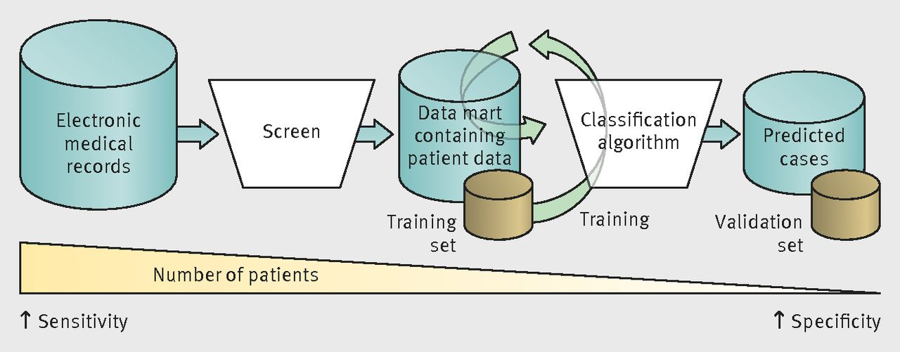
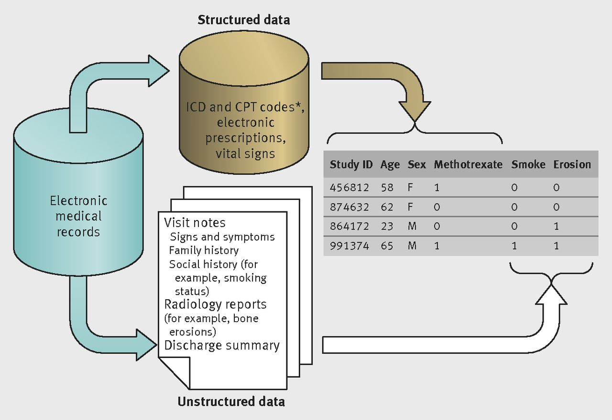
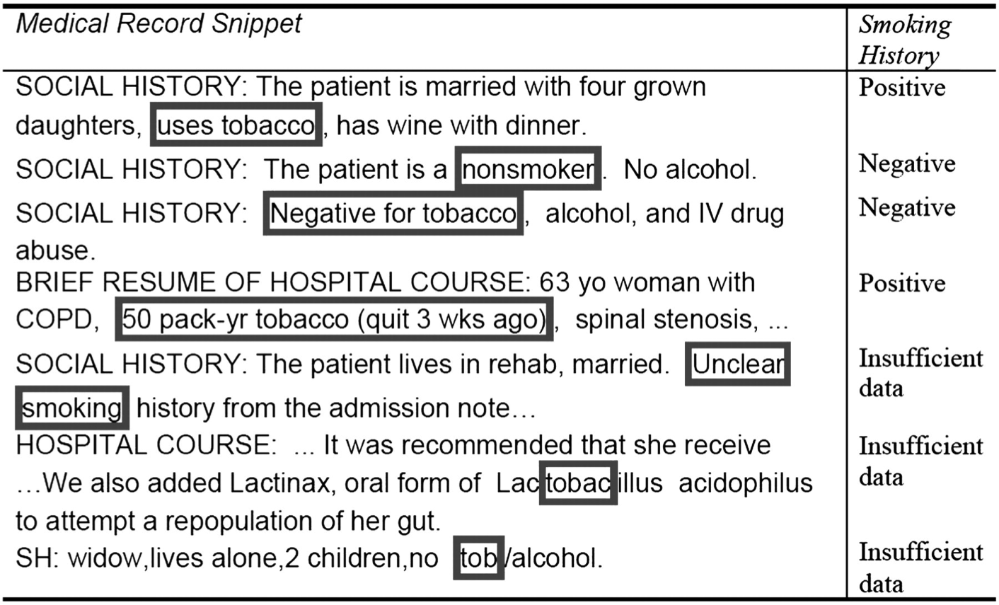
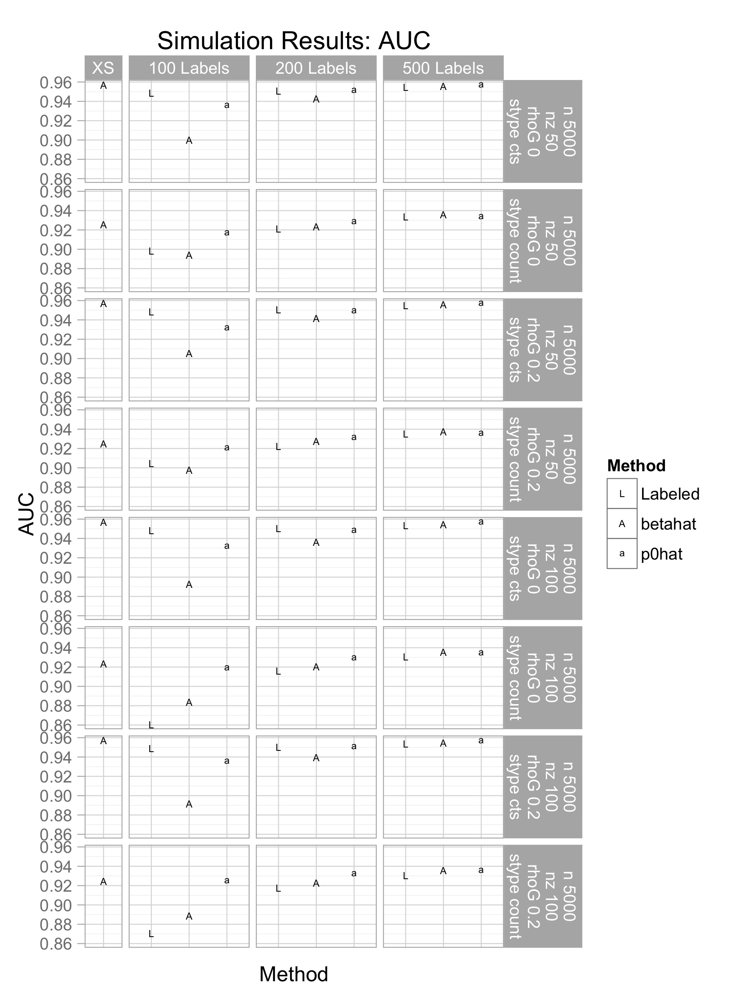
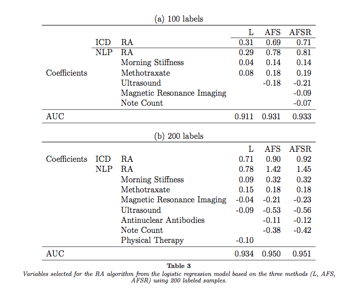
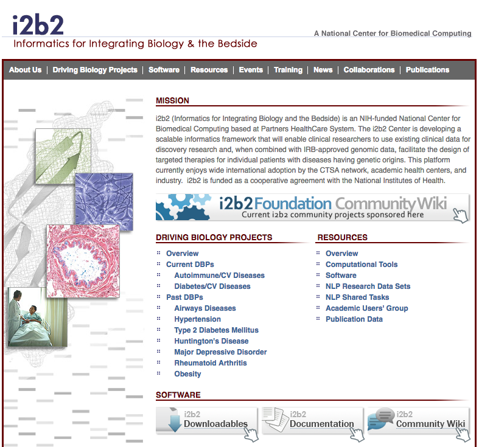

```{r setup, include=FALSE}
knitr::opts_chunk$set(echo = TRUE, eval=TRUE, message=FALSE, warning=FALSE)
```


## EMR Research Challenge

<font style="color: blue;">Large detailed data set</font>
+ <font style="color: red;">Complex disease</font>
+ <br><font style="color: green;">Messy diagnostic codes</font> + <font style="color: purple;">Free text fields</font>

= 

Who are _**true**_ disease cases?

## EMR Research Challenge



<p style="font-size:15px">
Liao et al. Development of phenotype algorithms using electronic medical records and incorporating natural language processing BMJ 2015; 350 :h1885
</p>

## EMR Research Data



<p style="font-size:15px">
Liao et al. Development of phenotype algorithms using electronic medical records and incorporating natural language processing BMJ 2015; 350 :h1885
</p>

## Natural Language Processing

Turn text notes into variables:



<p style="font-size:15px">
S. Murphy, et. al, Instrumenting the health care enterprise for discovery research in the genomic era, Genome Research , 19(9): 1675–1681 (2009).
Copyright 2009 by Cold Spring Harbor Laboratory Press
</p>

## Example

- Rheumatoid Arthritis (RA)
- Partners Healthcare Systems => <font style="color: blue;">46k potential RA subjects</font>
- <font style="color: blue;">Goal:</font> genetic study of RA patients, recruit a cohort of cases
- Clues:
    + <font style="color: blue;">ICD-9 code for RA (false positive rate of ~30%, specificity 55%; Singh et al, 2004)</font>
    + NLP features: <font style="color: green;">mentions of "rheumatoid" or phrases such as "morning stiffness" in doctor's notes</font>
    + ICD code for related autoimmune disease
    + medications for RA</font>
- <font style="color: gold;">"Gold standard" diagnosis </font> = team of clinicians read notes and score patients $\ \Rightarrow$ <font style="color: red;">small training data</font>

## Statistical Questions

- <font style="color: blue;">Prediction or classification</font> of diseased vs not-diseased
    + Diagnostic and prescription codes
    + Natural Language Processing (NLP)
    + clinical variables
    + best model? regularized regression?
- <font style="color: blue;">Surrogate outcome</font>
    + Diagnoses not precise (mismeasured), may also diagnose patients from notes (text)
    + "true" outcome is laborious/expensive/limited


## Data!


```{r, echo=FALSE}
tmpdat <- readr::read_csv("images/emrselect_data_subsetRA.csv")
#DT::datatable(tmpdat,rownames=FALSE)
tibble::glimpse(tmpdat)
```

## `emrselect`

R package for statistical method:

1. use surrogate outcome(s) to <font style="color: blue;">estimate <br>$\ \pi_S$=P(diseased | surrogates)</font>
    + mixture model clustering<br>
2. build <font style="color: blue;">prediction model with $\ \pi_S$ as outcome</font>
    + logistic regression: regularized (adaptive LASSO), misspecified ($\ \pi_S$ outcome)<br>
3. gold standard labels? <font style="color: blue;">re-fit regression</font> on smaller data set

<https://github.com/jminnier/emrselect>

## Prediction and Classification - Normal Setting

<font style="color: red;">We know $\ Y$ = disease status = 0 or 1 <br>on a training and validation set</font>

<font style="color: blue;">We have other data $\ \boldsymbol{X}$ = covariates<br>
i.e. ICD codes, clinical variables, NLP features</font>

<font style="color: green;">Goal: Estimate $\ \pi = P(Y=1 | \boldsymbol{X})$
</font>

## Prediction with Surrogate Outcomes

<font style="color: red;">We do not know $\ Y$ = disease status = 0 or 1 <br>(except maybe on small subset)</font>

<font style="color: blue;">We do know $\ \boldsymbol{S} = S_1, S_2, \ldots$ = surrogate outcomes<br>
i.e. ICD-9 code for RA, # of times RA mentioned in note (NLP feature count)</font>

<font style="color: green;">Goal: predict $\ Y$ using $\ \boldsymbol{S}$ and $\ \boldsymbol{X}$</font>

1. estimate $\ \pi_S = P(Y=1 | \boldsymbol{S})$
2. use $\ \hat{\pi}_S$ as outcome in prediction model with $\ \boldsymbol{X}$ as covariates
3. estimate $\ \pi = P(Y=1 | \boldsymbol{X}, \boldsymbol{S})$


## Mixture Model

<font style="color: red;">Estimate $\ \pi_S = P(Y=1 | \boldsymbol{S})$</font>

Assume two-component (Gaussian) mixture model:

$$\ \boldsymbol{S} \sim \tau\cdot f_1(\boldsymbol{s}) + (1-\tau)\cdot f_0 (\boldsymbol{s})$$

where $\ \tau = P(Y=1)$

```{r, echo=FALSE}
colvec = 1:3
ltyvec = 1
ss = seq(-15,50,.1)
trued = .2*dnorm(ss,1,3) + .8*dnorm(ss,20,5)
yl = c(0,max(dnorm(ss,1,3),dnorm(ss,20,5)))
plot(ss,trued,type="l",
     ylim=yl,xlab="S",ylab="Density",main="Gaussian Mixture, P(Y)=0.2")
points(ss,dnorm(ss,1,3),col="red",type="l")
points(ss,dnorm(ss,20,5),col="green",type="l")
legend(x="topright", legend=c("Mixture P(S)","P(S|Y=0) = N(1,3)","P(S|Y=1) = N(20,5)"), 
       col=colvec, lty=1)
```

## Mixture Model 

extend to multiple $\ \boldsymbol{S}$ surrogates = multivariate mixture modeling


<p style="font-size:15px">MathWorks Documentation <https://www.mathworks.com/help/examples/stats/></p>

## Mixture Model 

- solve with Expectation-Maximization algorithm
- Gaussian mixture modeling <font style="color: blue;">`mclust`</font> package
    + estimates mean and variance of the two Normal distributions, and $\ P(Y=1)$
- `emrselect::ProbD.S()` estimates $\ \pi_S$ from `mclust` output with Bayes Rule

$$\
\hat{\pi}_S = \frac{\hat{\tau}\hat{f}_1(s)}{\hat{\tau}\hat{f}_1(s) + (1-\hat{\tau}) \hat{f}_0(s))}
$$

<br>
<p style="font-size:20px", align="right">
See sections 6.8, 8.5 in *The Elements of Statistical Learning* (Hastie, Tibshirani, Friedman 2009)
</p>

## Prediction Model

Usual logistic likelihood objective function (`glm`):

$$\ n^{-1} \sum_{i=1}^{n} \left[ y_i\boldsymbol{\beta}^{T}x_i + \log(1+\exp(\alpha + \boldsymbol{\beta}^{T} x_i))\right]$$

Adaptive LASSO logistic regression (`glmpath`, `glmnet`):

\definecolor{red}{RGB}{251,0,29}
$$\ 
n^{-1} \sum_{i=1}^{n} \left[ y_i\boldsymbol{\beta}^{T}x_i + \log(1+\exp(\alpha + \boldsymbol{\beta}^{T} x_i)) \right] +
\color{red}{\lambda_n \sum_{j=1}^p |\beta_j|/|\tilde{\beta_j}|} $$

Our objection function (`emrselect::Est.ALASSO.GLM`):

$$\ n^{-1} \sum_{i=1}^{n}\left[ \color{red}{ \hat{\pi}_{Si}}\boldsymbol{\beta}^{T}x_i + \log(1+\exp(\alpha + \boldsymbol{\beta}^{T} x_i))\right] + \lambda_n \sum_{j=1}^p |\beta_j|/|\tilde{\beta_j}| $$

## Prediction Model

- <font style="color: blue;">Quasi-logistic</font> regression with $\ \hat{\pi}_S$  response, $\ \boldsymbol{X}$  predictors
- <font style="color: blue;">regularized regression</font> to select important $\ \boldsymbol{X}$ variables
    + minimize adaptive LASSO logistic objective func. w.r.t. $\ \boldsymbol{\beta}$
    + Package <font style="color: blue;">`glmpath`</font> for fitting regression
    + Select tuning parameter $\lambda_n$ with BIC
- <font style="color: blue;">Statistics</font>
    + Theory says we can select important $\ \boldsymbol{X}$ well
    + Obtain estimate of $\ E(\pi_S|\boldsymbol{X})$
- <font style="color: blue;">Prediction:</font>
$$\ \color{red}{ \hat{Y_0} = \mbox{logit}^{-1}(\hat{\alpha}+\hat{\boldsymbol{\beta}}^{T} \boldsymbol{X_0})}$$
- Prediction with labels (refit regression on labeled data)

$$\ \color{red}{ \hat{Y_0}^* = \mbox{logit}^{-1}(\hat{\alpha}+\hat{\boldsymbol{\gamma}}^{*T}\boldsymbol{S}_0 + \hat{\boldsymbol{\beta}}^{*T} \boldsymbol{X_0})}$$

<br>
<p style="font-size:20px", align="right">
See sections 3.4, 4.4 in *The ESL* (Hastie, Tibshirani, Friedman 2009)
</p>

## How well does the model work?

- Measures of prediction accuracy on "labeled" data (validation data)
    + AUC = area under the Receiver Operating Curve (ROC)
- Model size, variables selected

<font style="color: green;">
Goal: <br>auto model predict $\ \geq$ model w/ labeled data <br>$\ \Rightarrow$ reduce or avoid labeling!
</font>

## Classify RA patients

- Partners Healthcare System
    + 46k potential RA subjects (at least one ICD-9 code for RA and related diseases, or had received common RA diagnosis test)
    + 435 gold standard labels by team rheumatologists
- Surrogates: counts of NLP mentions of RA in records, RA ICD-9 code
- $\ \boldsymbol{X}$ = 81 predictors

- adaptive LASSO $\ \leftrightarrow$ 32 predictors
    + NLP: morning stiffness, methotraxate, ultrasound, MRI
- labeled data with Y vs "automated feature selection" with S

## Results



<font style="color: blue;"> with > 200 labels </font> <font style="color: green;">AUC logistic adaptive LASSO regression </font>
</font>$\ \approx$ 
<font style="color: red;"> AUC with automated feature selection.</font>


## Results

 <p style="font-size:20px", align="right">
Minnier, Gronsbell, Yu, Liao, Cai (in progress)</p>

## Future

- Improve code: efficiency, speed, commenting and documentation
- Add simulation and analysis code, with example data set
- Other uses?
    + Risk prediction of related diseases?
    + Select cohorts with high risk for prospective studies?
    + Clustering and prediction with other data?
- Other machine learning methods for prediction?

## Explore EMR data (i2b2.org)



## Thank You

Jessica Gronsbell, Harvard Biostatistics<br>
Sheng Yu, Tsinghua University, Beijing, China<br>
Katherine Liao, Brigham and Women's Hospital, Boston<br>
Tianxi Cai, Harvard Biostatistics<br>

"Automated Feature Selection of Predictors in Electronic Medical Records Data" in progress
<br>
<br>
<font style="color: blue;">R package `emrselect` also in progress: https://github.com/jminnier/emrselect</font>
