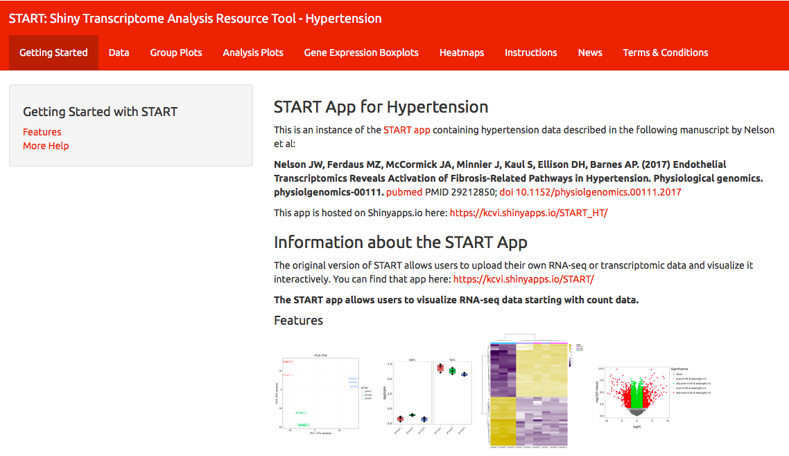
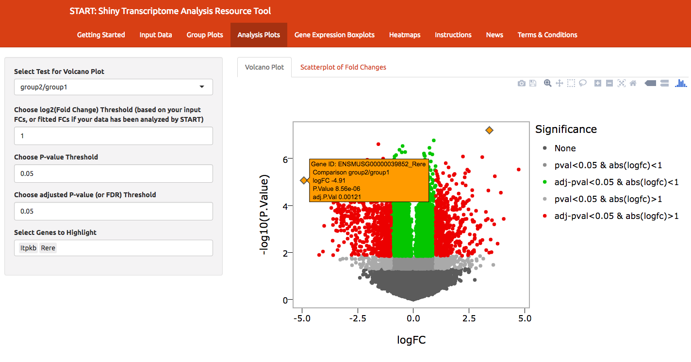
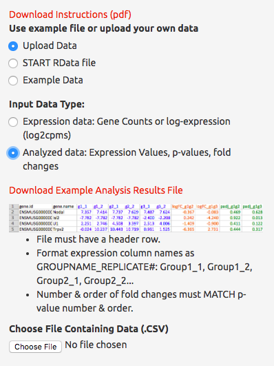

```{r setup, include=FALSE}
options(htmltools.dir.version = FALSE)
```


class: center, middle

# Why Shiny?

---

background-image: url(spreadsheetcombo.png)
background-position: center;

class: middle, center

# Motivation

## Too many spreadsheets!

---

## Motivation

<font style="color: darkorange;">"Can you make me this plot? Ok now this plot? Wait one more plot..."</font>

</img>

---

background-image: url(toomanyplots.png)
background-repeat: repeat-x;


# Motivation

## Too many plots!

---
background-image: url(shinyhex.png)
background-position: 50% 50%
background-size: 50%

# Enter, Shiny!

---

# First, a History

- Started with <font style="color: darkorange;">Tableau</font>
     + Tableau + R + Bioconductor = :-| (in 2013)
     + Not easily shared
- Realization: <font style="color: darkorange;">Shiny</font> can do this!

## Motivation: help my collaborator

- Created one site with <font style="color: darkorange;">one data set</font>

## Motivation: help everyone

- Created general site for <font style="color: darkorange;">input data set</font>

---
class: middle, center, inverse

# Motivation For All:

## Distribute your hard work!

---

#  *Collaborator:* "How can I share my data?"

</img>
<https://kcvi.shinyapps.io/START_HT/>

---

# *Developer/Statistician/Data Scientist*: <br>"How can I get people to use my new method/package?"

</img>
<http://qvalue.princeton.edu/>

---

# *Developer/Statistician/Data Scientist*: <br> Look at this analysis I did!

</img>
<https://gallery.shinyapps.io/TSupplyDemand/>

---

# *Everyone:* Teach! (`learnr`)

</img>
<https://minnier.shinyapps.io/ODSI_continuousData/>

---
# Shiny basics

```{r, eval=FALSE}
# what you see, client side
ui <- fluidPage(
  
  
  
)
```

```{r, eval=FALSE}
# computations here!
server <- function(input, output) {
  
  
  
  
}
```


```{r, eval=FALSE}
# run the app!
shinyApp(ui = ui, server = server)
```


---
# Shiny basics

```{r, eval=FALSE}
# what you see, client side
ui <- fluidPage(
  # Title, panels
  plotOutput("myplot"), #from output$myplot
  selectInput("foo",choices=allthechoices)
)
```

```{r, eval=FALSE}
# computations here!
server <- function(input, output) {
  
  
  
  
}
```


```{r, eval=FALSE}
# run the app!
shinyApp(ui = ui, server = server)
```

---
# Shiny basics

```{r, eval=FALSE}
# what you see, client side
ui <- fluidPage(
  # Title, panels
  plotOutput("myplot"), #from output$myplot
  selectInput("foo",choices=allthechoices)
)
```

```{r, eval=FALSE}
# computations here!
server <- function(input, output) {
  # reactive plots
  output$myplot <- renderPlot({ ggplot(yay) + geom_point() })
  # use input$foo here, maybe observe changes in UI
  observe({ dostuff(input$foo) })
}
```


```{r, eval=FALSE}
# run the app!
shinyApp(ui = ui, server = server)
```

---

# An example: START


<font style="color: darkorange;">S</font>hiny 
<font style="color: darkorange;">T</font>ranscriptome
<font style="color: darkorange;">A</font>nalysis
<font style="color: darkorange;">R</font>esource
<font style="color: darkorange;">T</font>ool

<br>
Github: <https://github.com/jminnier/STARTapp>

<br>
<font style="color: green;">
DATA = <em>RNA-seq gene expression</em>
</font>


---

# Very quick tour


---

# Very quick tour


<!--- https://gist.github.com/dergachev/4627207 for screencast to gif --->


---

# Analysis results, interactive



---

# Data exploration, interactive


---
class: inverse, middle, center

# Considerations

---

# Who is your audience?

## Example: START app

- likely biologists
- may not be used to coding or large data sets

</img>
---

# Challenges: *User*

<font style="color: darkorange;">Data is larger</font> than they are used to + <font style="color: darkorange;">Cannot query or share</font> results easily
<br>
<br>
Interactive <font style="color: darkorange;">search</font> boxes/filtering + <font style="color: darkorange;">Reactive visualization</font>


---

# Challenges, Input/Ouput Data

- Input data ~ multiple formats: <font style="color: darkorange;">Special input formats</font>
- Interface with other software? <font style="color: darkorange;">Export special formats</font>

</img>

---

# Challenges, Input/Ouput Data

- Input data ~ multiple formats: <font style="color: darkorange;">Special input formats</font>

</img>
<https://biit.cs.ut.ee/clustvis/>


---

# Challenges, Input/Ouput Data

- Input data ~ multiple formats: <font style="color: darkorange;">Special input formats</font>

</img>
<https://biit.cs.ut.ee/clustvis/>
---

# Challenges, Analysis

## Many possible ways to analyze data: 

- RNA-seq data has <font style="color: darkorange;">many analysis pipelines</font> (edgeR, DESeq2, limma)
- <font style="color: darkorange;">Complex study designs</font>
    + repeated measures
    + multiple pairwise comparisons vs overall group comparisons
- How to allow for so many possibilities?

--

### Balance flexibility/simplicity/**CORRECT**ness

- Too many options $\rightarrow$ high likelihood of <font style="color: darkorange;">incorrect use</font> of analysis tools


---

# Challenges, Analysis

### Many possible ways to analyze data: 

- Restrict analyses performed
- Allow for uploading of analysis results



---
class: center, middle

# Challenges, Analysis

## Look at the data! (QA/QC)

---

# Challenges, Analysis: QA/QC

### Present QA plots up front


<https://github.com/joey711/shiny-phyloseq>
</img>

---

# Challenges, Analysis: QA/QC

### Does this data look "weird"?


---
class: center, middle, inverse

# Responsibilities

## How do we avoid "data fishing"?

## (Food for thought)

---

# Responsibilities

## - Are resulting analyses <font style="color: darkorange;">correct</font>?

## - Are we encouraging <font style="color: darkorange;">"torturing the data until it speaks"</font>?


## - Misuse of <font style="color: darkorange;">p-values</font>?


---

# Responsibilities: Visual inference

### <font style="color: darkorange;">Plots = statistics</font>

-- [Di Cook's](https://twitter.com/visnut) keynote at [rstudio::conf 2018](http://www.dicook.org/files/rstudio/#1)


### Solution?: Rorschach image tests

Generate <font style="color: darkorange;">null data sets and null plots</font> using permutation and simulation 

Can you pick out your data from a line up?

R package [`nullabor`](https://cran.r-project.org/web/packages/nullabor/vignettes/nullabor.html)

---

background-image: url(http://visiphilia.github.io/assets/skittles-lineup1.png)
background-position: 50% 90%
background-size: 80%

# Visual inference: Apophenia

http://visiphilia.github.io/assets/skittles-lineup1.png


---
class: inverse
background-image: url(start_heatmap.png)

# Too many heatmaps?

---

#  Room for misuse, possible solutions:

### - Use <font style="color: darkorange;">instructions</font> and data <font style="color: darkorange;">inputs</font> wisely.
### - Provide <font style="color: darkorange;">examples</font> of when advanced analyses are needed.
### - Provide <font style="color: darkorange;">examples</font> of statistical write ups based on app's results.
### - Avoid too many <font style="color: darkorange;">H0s</font>
### - Avoid <font style="color: darkorange;">p-values</font> (Bayesian posterior probabilities?)

---

# Landing page - Where am I?

- <font style="color: darkorange;">Show</font> what the app is for/can do
- Point to <font style="color: darkorange;">instructions</font> and <font style="color: darkorange;">guidelines</font>

Bonus: [Jasmine Dumas](https://jasdumas.github.io/) has a [`shinyLP`](https://github.com/jasdumas/shinyLP) package to help!
</img>

---

# Instructions, Please

- <font style="color: darkorange;">Extremely difficult.</font>
- Not just a <font style="color: darkorange;">vignette</font> of a package (users may not be coders)
-	<font style="color: darkorange;">Written</font> instructions vs. <font style="color: darkorange;">video</font> demos, <font style="color: darkorange;">gif</font> instructions

No one will use it if they don't know  <font style="color: darkorange;">**how**</font> to use it!
</img>
---
# Instructions

Tauno Metsalu and Jaak Vilo: "Clustvis"
</img>
---

# Instructions

Tauno Metsalu and Jaak Vilo: "Clustvis"
</img>

---

class: middle,center,inverse

# But Does It work?

---

# Debugging Tips

Debugging is notoriously a pain here

</img>

---

# Thanks, stack trace:

</img>

---

class: middle,center,inverse

# Did you update a package?

---

# Old fashioned methods work best

<font style="color: darkorange;">Breakpoints and tracing:</font>

- `browser()` - I didn't say it was fun
- `print()` - every single function/observe statement gets a print

</img>

---

# New methods are useful

`runApp(..., display.mode="showcase")`

But, doesn't show why something broke.

</img>

---

# Final Tips

## Put on your Software Development Hat!

- Test it first
    + Unit testing can save you so much headache (packages: [`testthat`](http://testthat.r-lib.org/), [`shinytest`](https://rstudio.github.io/shinytest/))
    + Run tests on example data
    + Create .Md file of test plots
- Security
    + Are users uploading sensitive data?
    + Security review of public apps vs commercial version
- Speed: [Why so slow?](https://support.rstudio.com/hc/en-us/articles/115000171848-Why-are-my-Shiny-apps-are-running-slowly-)
    + Rprofiler in Rstudio
    + Reduce start up time

---

# Be Creative!

[papr by Lucy D'Agostino McGowan, Nick Strayer, Jeff Leek](https://jhubiostatistics.shinyapps.io/papr/)
</img>

---

# Have fun!

[homebrewR by David Stephens](https://davesteps.shinyapps.io/homebrewR/)
</img>

---

# Thank you! Go forth and shiny!
<br>

Contact: @ [datapointier](https://twitter.com/datapointier), email: minnier-[at]-ohsu.edu

Github: <https://github.com/jminnier/STARTapp>

Slides available at  <font style="text-transform: lowercase;"><http://bit.ly/shiny-csp18></font> <br>

Code for slides available at <https://github.com/jminnier/talks>

Slides created via the R package [xaringan](https://github.com/yihui/xaringan) by [Yihui Xie](https://twitter.com/xieyihui?lang=en) with the [Rladies](https://alison.rbind.io/post/r-ladies-slides/) theme by [Alison Hill](https://twitter.com/apreshill).