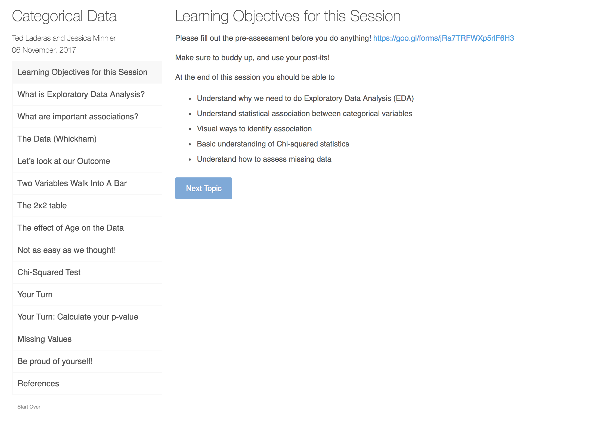
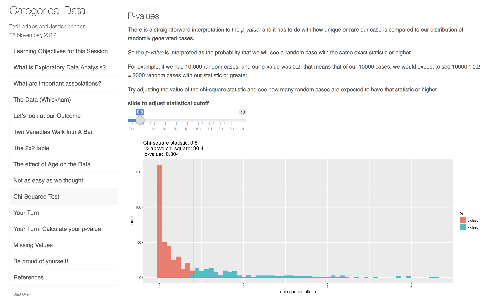
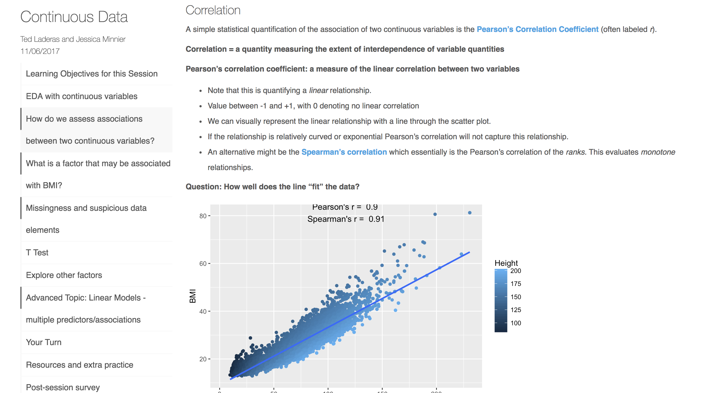
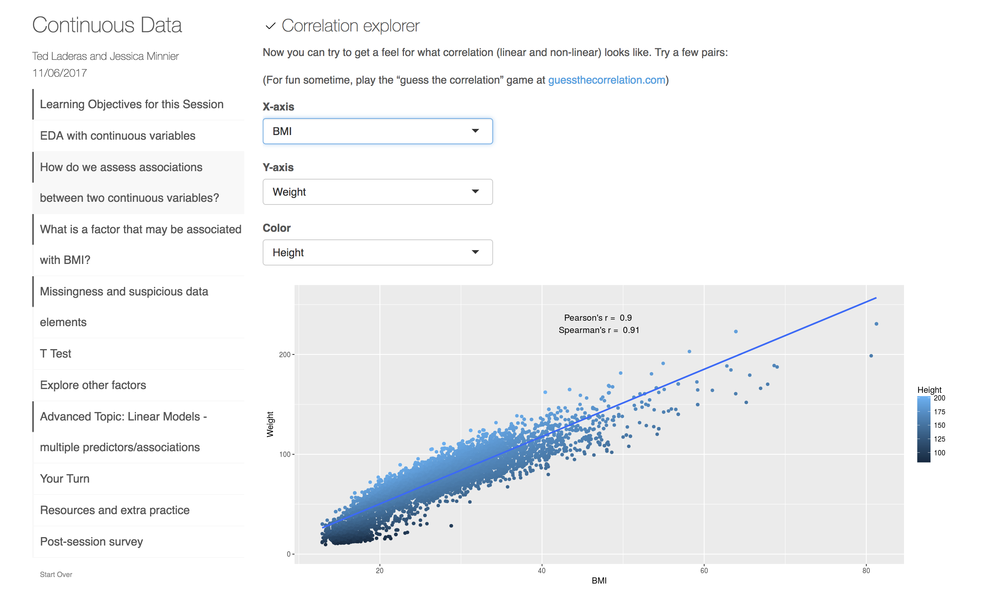
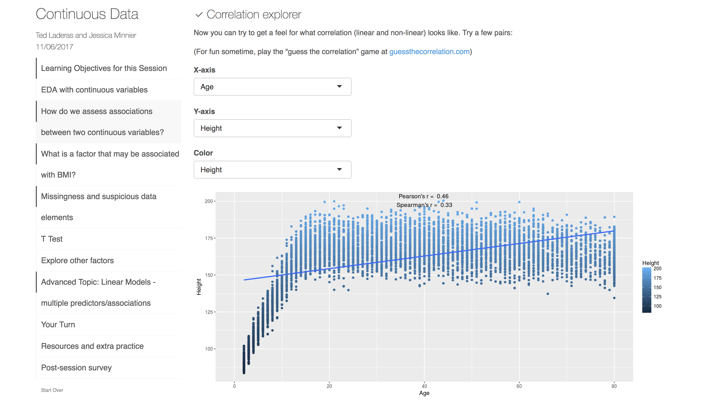
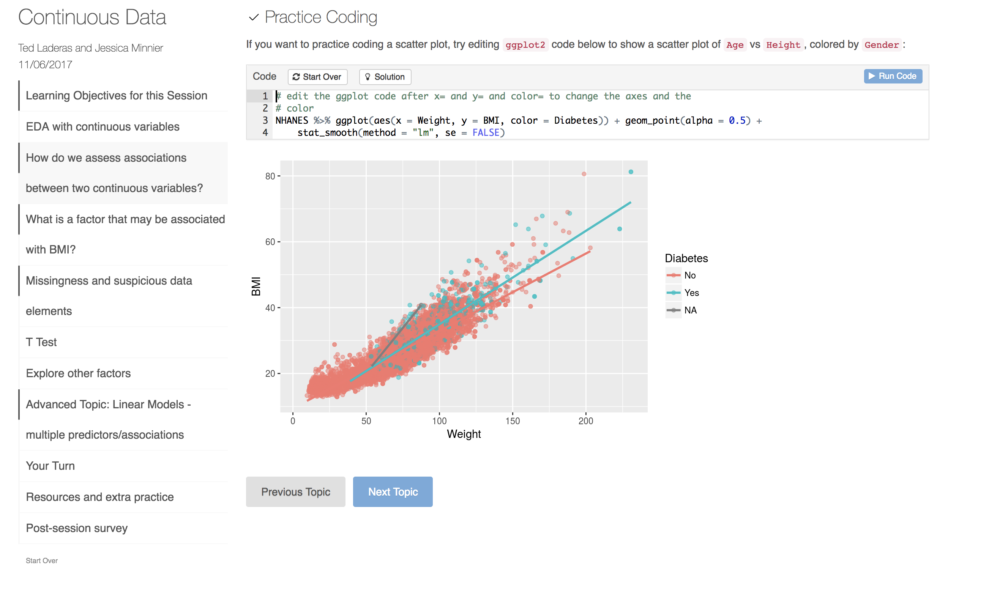
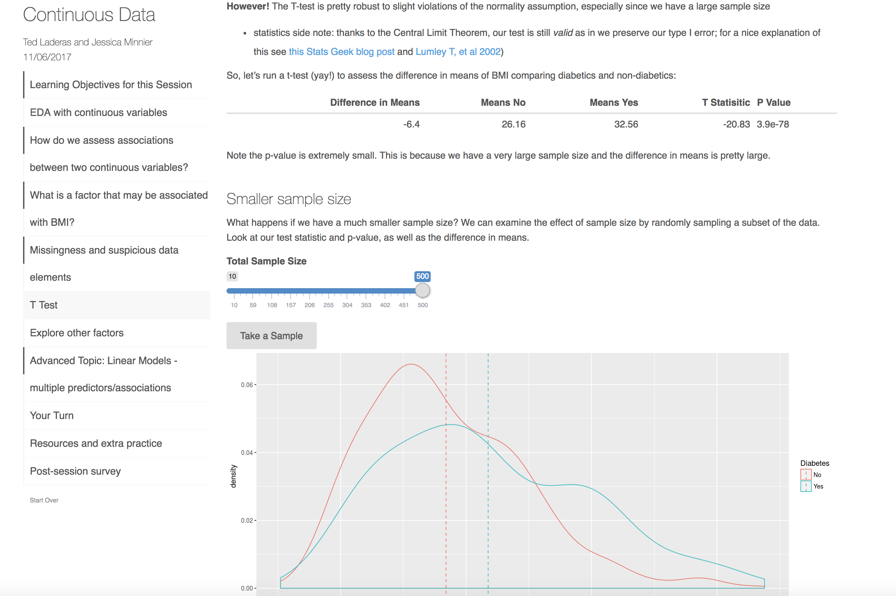

```{r setup, include=FALSE}
options(htmltools.dir.version = FALSE)

library(tidyverse)

knitr::opts_chunk$set(
  warning=FALSE, 
  message=FALSE, 
  fig.width=10.5, 
  fig.height=4, 
  comment=NA, 
  rows.print=16,
  echo=FALSE)
theme_set(theme_bw(base_size = 24))
```


# Setting

## <font style="color: #EB811B;">OHSU Data Science Institute</font> 

- 2 Day workshop
- 3 Hours for <font style="color: #EB811B;">"Introduction to Statistics and Data Exploration"</font>
- Aim of DSI: "bring together researchers, librarians, and information specialists for formal training on key topics in data science"

## Audience

- Librarians, information scientists, researchers
- Very little mathematical/programming background
- <font style="color: #EB811B;">Heterogeneous background</font> in science and research

---

# Goals


## Statistical Concepts

- Start with the <font style="color: #EB811B;">didactics</font>
- Use <font style="color: #EB811B;">interactive visualizations</font> to illustrate statistical concepts

## Data Exploration

- Empower students to <font style="color: #EB811B;">explore data (no fear!)</font>
- Encourage understanding of relationships of data

## Interactivity

- Interactive plots for exploration of <font style="color: #EB811B;">multi-variable relationships</font>
- Include some <font style="color: #EB811B;">coding exercises</font> (as bonus material)


---

# Methods

## Approach

- Implement as a <font style="color: #EB811B;">LearnR Tutorial</font>, but used with didactic teaching
- LearnR: uses <font style="color: #EB811B;">Shiny</font> to build interactive R Markdown style workbooks
- Can be deployed as a website, or on student’s computer (requires R/Rstudio)

## Practicalities

- <font style="color: #EB811B;">Categorical data</font> session and <font style="color: #EB811B;">continuous data</font> session
- Hosted on github as a package on Github <font style="color: #EB811B;">laderast/DSIExplore</font> (https://github.com/laderast/dsiexplore)
- Hosted workbooks on shinyapps.io for real time interactivity

---

# Interactivity


- Didactic lessons embedded in workbooks with interactive components
- <font style="color: #EB811B;">Interactive sliders, dropdown options</font> allow interaction with data filtering and analysis
- Interactive code teaches <font style="color: #EB811B;">effect of changing code components</font> on visualizations/analyses


---
class: clear
.font70[https://tladeras.shinyapps.io/categoricalData/]




---
class: clear


---
class:clear




---
class: clear

.font70[https://minnier.shinyapps.io/ODSI_continuousData/]



---
class: clear



---
class: clear



---
class: clear



---
class: clear


---

# Conclusions & Results


- LearnR package + Shiny in R → interactive workbooks
- Students were <font style="color: #EB811B;">empowered to learn</font>
- Students liked the visualizations
    + “Very well done and methodical treatment - the sliders were great!”
- Students felt engaged with the subject
    + “Explanation of key statistical concepts was effective and really made me want to learn more.”
- Pre/Post-workshop survey: <font style="color: #EB811B;">95% of learners (survey responders) felt they gained practical knowledge (n=22)</font>

---

# Survey Results

```{r, fig.height=3.5}
res_data <- read_csv(here::here("2018_07_JSM_InteractiveLearning","odsi_post_clean.csv")) %>% 
  janitor::clean_names() %>% 
  rename(eda_score_pre = please_rate_your_level_of_ability_for_eda_prior_to_this_session,
         eda_score_post = please_rate_your_level_of_ability_for_eda_after_this_session,
         stat_score_post = please_rate_your_level_of_understanding_of_statistical_analysis_results_after_this_session,
         stat_score_pre = please_rate_your_level_of_understanding_of_statistical_analysis_results_prior_to_this_session)

ggplot(res_data,aes(eda_score_pre,fill=factor(eda_score_pre)))+geom_bar()+
  viridis::scale_fill_viridis(discrete = TRUE,guide=FALSE)+
  ggtitle("Please rate your level of ability for EDA\nprior to this session")+ylim(0,11)

ggplot(res_data,aes(eda_score_post,fill=factor(eda_score_post)))+geom_bar()+
  viridis::scale_fill_viridis(discrete = TRUE,guide=FALSE)+
  ggtitle("Please rate your level of ability for EDA\nafter this session")+ylim(0,11)


```


```{r, include=FALSE}
# not enough time
ggplot(res_data,aes(stat_score_pre,fill=factor(stat_score_pre)))+geom_bar()+viridis::scale_fill_viridis(discrete = TRUE,guide=FALSE)+
  ggtitle("Please rate your level of understanding of statistical analysis results\nprior to this session")

ggplot(res_data,aes(stat_score_post,fill=factor(stat_score_post)))+geom_bar()+viridis::scale_fill_viridis(discrete = TRUE,guide=FALSE)+
  ggtitle("Please rate your level of understanding of statistical analysis results\nafter this session")

res_data_long <- res_data%>% select(eda_score_pre:stat_score_post) %>% gather()


ggplot(res_data_long,aes(value,fill=factor(value)))+
  geom_bar()+
  facet_wrap(~key,nrow=2)+
  viridis::scale_fill_viridis(discrete = TRUE,guide=FALSE)
```


---

# Impact

## Pros:

- <font style="color: #EB811B;">Accessible</font> to beginners
- Mathematical concepts are more <font style="color: #EB811B;">memorable</font>
- Sparks <font style="color: #EB811B;">discussions</font>
- Empowers and engages students in <font style="color: #EB811B;">scientific discovery/analysis</font>

## Cons:

- <font style="color: #EB811B;">Advanced</font> students may require more challenging activities
- Visualizations must be tested for <font style="color: #EB811B;">effectiveness</font>
- Requires <font style="color: #EB811B;">programming</font> skills to implement

---

# Future Work and Adaptations

- Expand materials with more advanced statistical concepts
- Longer workshops $\longrightarrow$ more interactive material, more topics
- Determine which interactive explorations are most effective

## Introduction to Visualization/Data Literacy

- Extension of this work: https://tladeras.shinyapps.io/dataLiteracy/
- [HMSP410, Health Informatics](https://laderast.github.io/HSMP410/) for OHSU-PSU School of Public Health (co-taught by Ted Laderas and Bill Hersh)

---

# Further Information


- eCOTS e-poster: https://www.causeweb.org/cause/ecots/ecots18/posters/3-03
- Categorical Data: https://tladeras.shinyapps.io/categoricalData/
- Continuous Data: https://minnier.shinyapps.io/ODSI_continuousData/ 
- LearnR package: https://rstudio.github.io/learnr/ 
- DSIexplore LearnR package: https://github.com/laderast/DSIExplore 


---

# Thank you!
<br>

Ted Laderas, PhD <i class="fa fa-twitter fa-fw"></i> [laderas](https://twitter.com/laderas), <i class="fa fa-github fa-fw"></i> [laderast](https://github.com/laderast/) <i class="fa fa-globe fa-fw"></i> https://laderast.github.io/ 

Contact me: <i class="fa fa-envelope fa-fw"></i> minnier-[at]-ohsu.edu, <i class="fa fa-twitter fa-fw"></i> [datapointier](https://twitter.com/datapointier), <i class="fa fa-github fa-fw"></i> [jminnier](https://github.com/jminnier/)

Slides available at  <font style="text-transform: lowercase;"><http://bit.ly/jsm-minnier></font> <br>

Code for slides available at <https://github.com/jminnier/talks_etc>

Slides created via the R package [xaringan](https://github.com/yihui/xaringan) by [Yihui Xie](https://twitter.com/xieyihui?lang=en) with the metropolis theme

