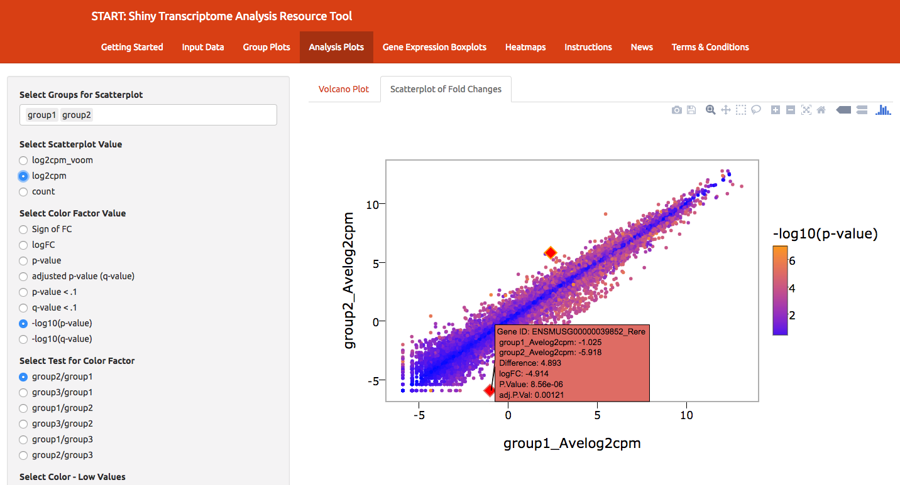
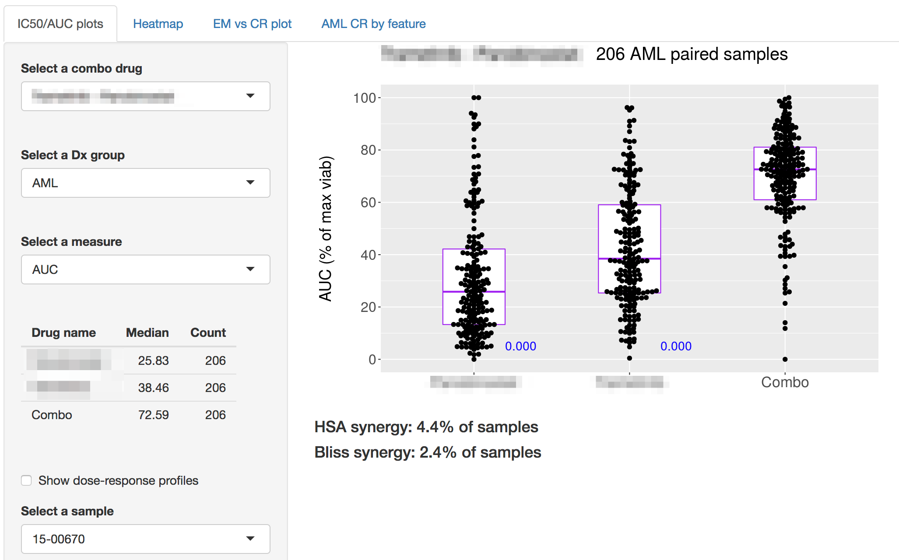
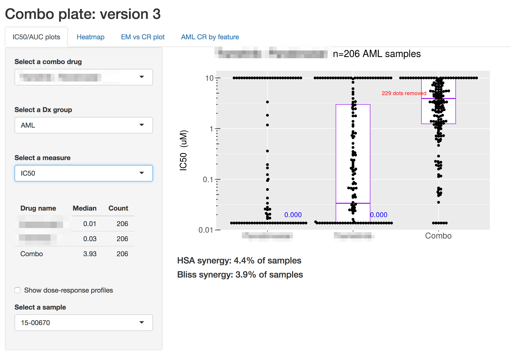
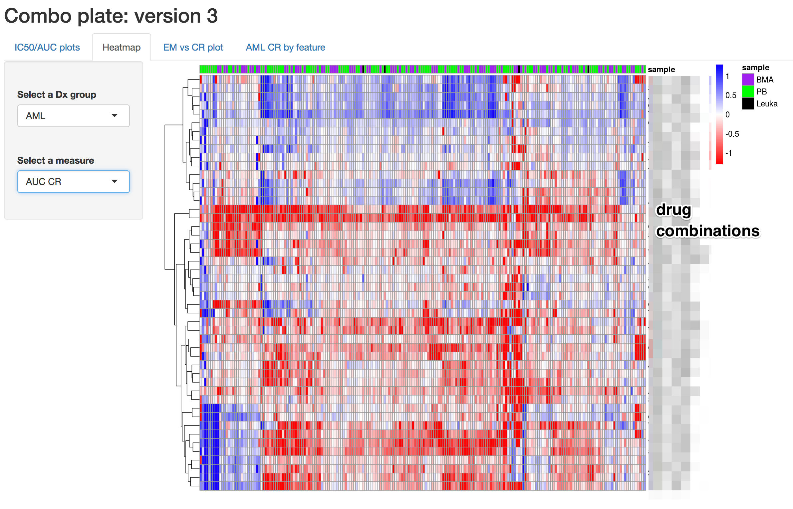
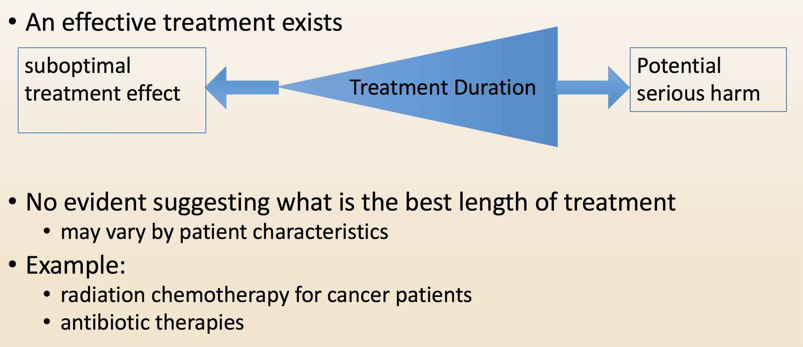
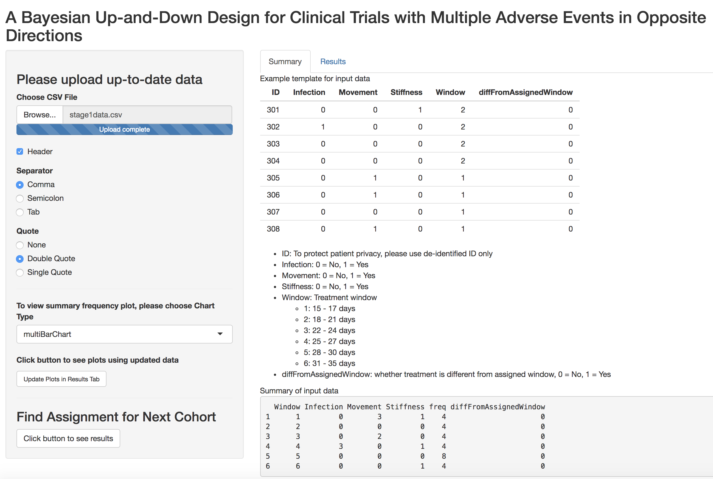
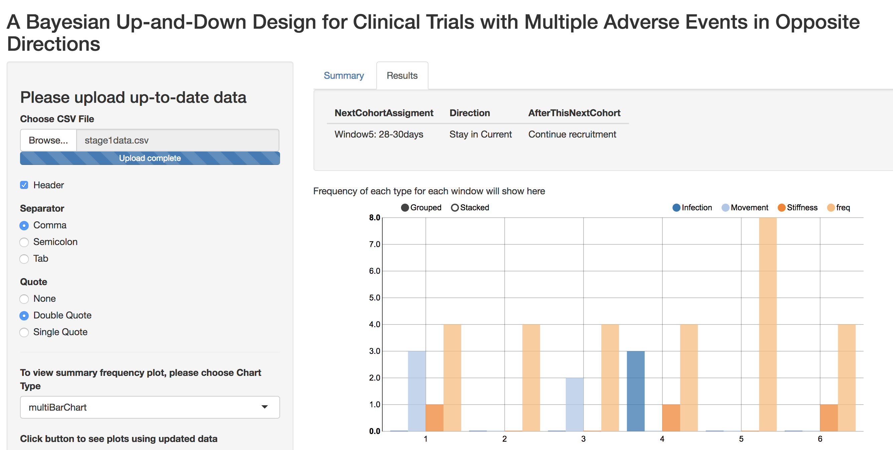

```{r setup, include=FALSE}
options(htmltools.dir.version = FALSE)

library(tidyverse)

knitr::opts_chunk$set(
  warning=FALSE, 
  message=FALSE, 
  fig.width=10.5, 
  fig.height=4, 
  comment=NA, 
  rows.print=16,
  echo=FALSE)
theme_set(theme_bw(base_size = 24))
```


# Our Team

## Biostatistics Shared Resoure


<br>


<!---

# Some Examples

## START: <font style="color: darkorange;">S</font>hiny <font style="color: darkorange;">T</font>ranscriptome<font style="color: darkorange;"> A</font>nalysis<font style="color: darkorange;"> R</font>esource<font style="color: darkorange;"> T</font>ool

RNA-seq/Microarray analysis and visualization

## Drug Combination in Cancer

Drug development

## Adaptive Bayesian Design

Clinical Trials Design
--->
---

class: inverse, center, middle


# Why Shiny?

---

background-image: url(figs/spreadsheetcombo.png)
background-position: center

# Motivation

## Too many spreadsheets!

---

# An example: START


<font style="color: darkorange;">S</font>hiny 
<font style="color: darkorange;">T</font>ranscriptome
<font style="color: darkorange;">A</font>nalysis
<font style="color: darkorange;">R</font>esource
<font style="color: darkorange;">T</font>ool

<br>

Github: <font style="color: darkorange;">https://github.com/jminnier/STARTapp/</font>
<br>
Shinyapps.io: <font style="color: darkorange;"> https://kcvi.shinyapps.io/START/</font>
<br>
<font style="color: green;">
DATA = <em>RNA-seq gene expression</em>
</font>


<!---

# Very quick tour


--->

# Very quick tour


<!--- https://gist.github.com/dergachev/4627207 for screencast to gif --->

---

# Data Input

- Input data ~ multiple formats: <font style="color: darkorange;">Special input formats</font>
- Interface with other software? <font style="color: darkorange;">Export special formats</font>

</img>
</img>

---

# Data Exploration: Interactive


---

# Drug Development

## Combination Therapy $\rightarrow$ Visualize drug synergy

*BSR*: Andy Kaempf, MS & Tomi Mori, PhD<br>
*Knight Cancer Leukemia Team*:  Steve Kurtz, PhD & Chris Eide, B.A.





---
class: clear



---
class: clear




---

# Clinical Trials Methods

## Bayesian Adaptive Design

$\rightarrow$ An Adaptive Bayesian Sequential Design for Determining the Subject-Specific Optimal Treatment Length
(manuscript in progress)

https://bayesiantrial.shinyapps.io/Bayesian12/

*BSR*: Yiyi Chen, PhD; Lina Gao, PhD<br>
*OHSU*: Zunqiu Chen, MS; Matthew F Halsey, PhD; Jodi Lapidus, PhD

- Select directions and weights of various outcomes
- Determine potential length of treatment to be evaluated
- Upload data
- Potential actions: Escalate; De-escalate; Stay


---

# General App & Trial Specific



---

class:clear




---
class: inverse, middle, center
# Tips/Lessons Learned

---

# Present QA plots up front


---

# Provide Instructions!


---

# Old fasioned debugging/logging works


---

# Conclusions

- R Shiny can be a tool to creatively interact with data
- Improve collaboration and promote your methods
- Avoid repetitive analyses and visualizations
- Instructions are vital

## START

- working on extensions to single-cell and proteomics specific analyses and visualizations
- (one day) switch to use modules
- we welcome collaboration!

---

# Thank you!
<br>

Contact me: <i class="fa fa-envelope fa-fw"></i> minnier-[at]-ohsu.edu, <i class="fa fa-twitter fa-fw"></i> [datapointier](https://twitter.com/datapointier), <i class="fa fa-github fa-fw"></i> [jminnier](https://github.com/jminnier/)

START: http://jessicaminnier.com/STARTapp/

RELATED SLIDES ON SHINY (Challenges/Responsibilities):
- Data Day Texas <http://bit.ly/shiny-ddtx>
- CSP: <http://bit.ly/shiny-csp18>

Slides available at  <font style="text-transform: lowercase;"><http://bit.ly/rpharma-minnier></font> <br>

Code for slides available at <https://github.com/jminnier/talks_etc>

Slides created via the R package [xaringan](https://github.com/yihui/xaringan) by [Yihui Xie](https://twitter.com/xieyihui?lang=en) with the metropolis theme

