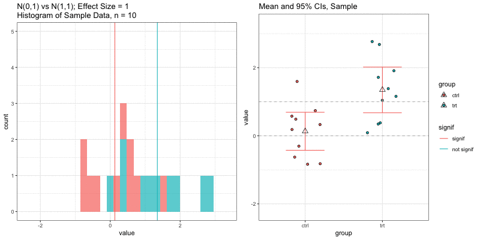
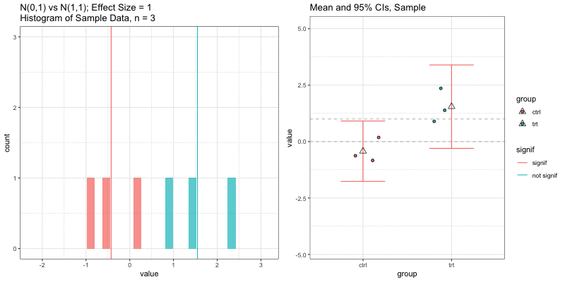
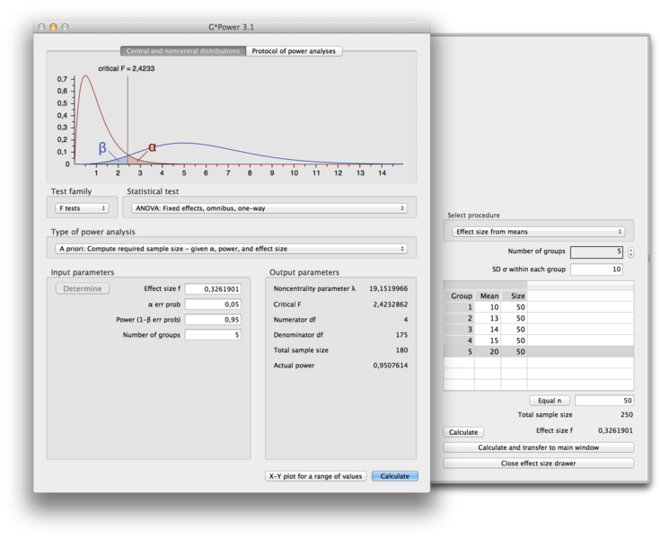
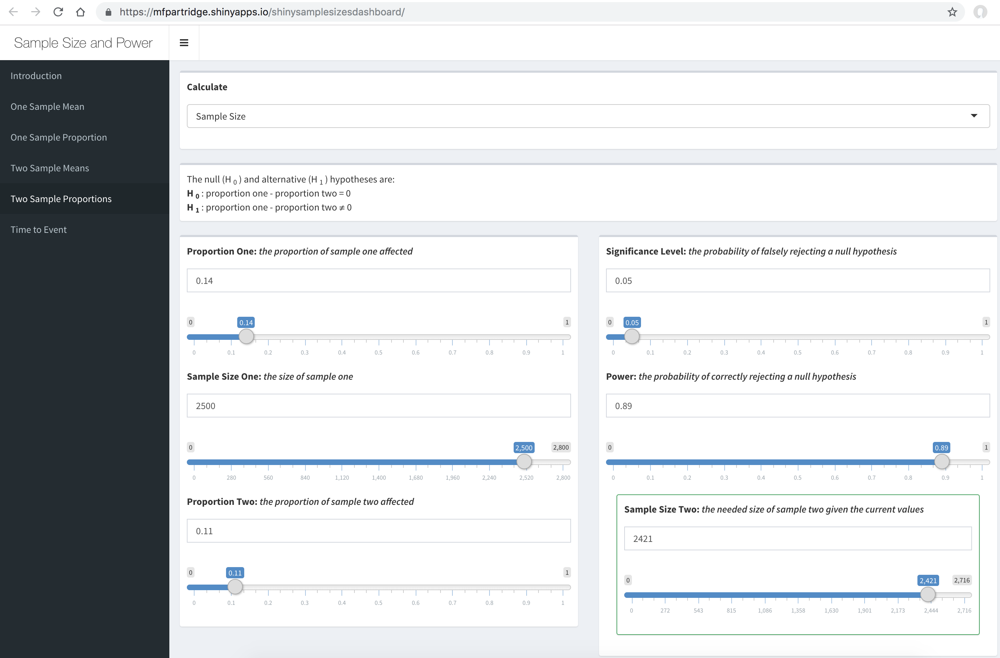

layout: true
  
<div class="my-footer"><span>bit.ly/aacr-power</span></div> 

---

```{r setup, include=FALSE}
options(htmltools.dir.version = FALSE)

library(tidyverse)

knitr::opts_chunk$set(
  warning=FALSE, 
  message=FALSE, 
  fig.width=10.5, 
  fig.height=4, 
  comment=NA, 
  rows.print=16,
  echo=FALSE)
theme_set(theme_bw(base_size = 24))
```

<!-- Xaringan/css themes stolen from Jennifer Thompson: https://github.com/jenniferthompson/RMedicine2018 Thanks, Jennifer! -->


```{r xaringan-themer, include = FALSE}
library(xaringanthemer)
mono_light(
  base_color = "#125972", ## picked to coordinate with rOpenSci logo
  code_highlight_color = "#c0e8f5",
  link_color = "#38BDDE",
  header_font_google = google_font("Josefin Sans"),
  text_font_google   = google_font("Montserrat", "300", "300i"),
  code_font_google   = google_font("Droid Mono"),
  text_font_size = "26px"
)
```

# Outline

- Why calculate sample size?
- What are the important components?
- Examples
- Software

---

# Goals of sample size and power calculations

- Design a study that will have enough information about underlying population to reject a hypothesis with high confidence.
- Calculate the number of sampling units (e.g. people, animals) you need to estimate statistics with a certain level of precision.

---

class: middle, center, inverse

# Design your study

---

# Step 1: State your research hypothesis

- Define your:
    + Population
    + Outcome variables/measurements
    + Predictor variables (i.e. treatment, age, genetic mutation)
- Be specific!
- Example: Among *women* (population you sample from), the *BRCA1* mutation
(predictor) is associated with an increased risk of developing *breast cancer* (outcome).
- **Question**: How many women do we need to sample/study to determine that BRCA1 is associated with breast cancer?

---

# Step 2: Choose your analysis and test(s)

- You can't calculate sample size without knowing which test and model you will use.
- How will you measure your outcome? Continuous? Categorical? Binary (yes/no)?
    + choose outcomes with high sensitivity and low measurement error
- How many groups/experimental conditions/predictors?
    + the more you have the more samples you will need
- What test? t-test? Linear regression? Random effects model? Chi-square test?


---

class: inverse, center, middle

# Calculate power and sample size

---

# Need to know (/tell your statistician!):

- Overall design (outcome, endpoint, hypothesis)
- Size/magnitude of effect of interest
    + What do you *hope* to detect
- Variability of measurements
    + Precision of your measurement, biological variability within population
- Level of type I error (significance level, $\alpha$)
- Level of power
- Other design details (number of groups, clustering, repeated measures)

---

# Components of Sample Size

Need to know 3 of the 4 to determine the 4th:

Measure | Definition
---|---
Effect Size | Magnitude of difference or assocation; <br>i.e. (difference in means)/(population standard deviation) = $\frac{\mu_1 - \mu_0}{\sigma}$ = $\Delta$
Sample Size | N
Type I Error / Significance level | $\alpha$ = probability of rejecting null hypothesis when it is true
Power  | 1 - $\beta$ = 1 - Type II error = probability of rejecting null hypothesis when it is false

---

# Components of Sample Size

Need to know 3 of the 4 to determine the 4th:

Do We Know? | Measure | Definition
---|---|---
?? | Effect Size | Magnitude of difference or assocation; <br>i.e. (difference in means)/(population standard deviation) = $\frac{\mu_1 - \mu_0}{\sigma}$ = $\Delta$
?? | Sample Size | N
0.05, 0.01 | Type I Error / Significance level | $\alpha$ = probability of rejecting null hypothesis when it is true
0.9, 0.8 | Power  | 1 - $\beta$ = 1 - Type II error = probability of rejecting null hypothesis when it is false

---

# What is **effect size**?

- Summarizes the outcome of interest
- Magnitude of difference or assocation
- Specification depends on study design and statistical model/test

--

## Examples:

- Difference in treatment and control mean outcomes, relative to variance (standard deviation)
- Correlation coefficient of
- Risk ratio of breast cancer comparing BRCA carriers to non-carriers
- Magnitude of regression coefficient


---

# Effect size must be

- **pre-specified**
- based on what is meaningful biologically or clinically (not statistical significance)
- based on pilot data or literature review if available

---

# Simple example

Outcome = Continuous measurement

Predictor = Treatment yes/no (treatment vs control group)

Test: two sample T-test, equal variance

Effect Size: difference in means divided by standard deviation of population $\frac{\mu_{trt} - \mu_{ctrl}}{\sigma}$

Null Hypothesis: Difference in means = 0

Alternative Hypothesis: Difference in means $\neq$ 0

"Given a desired effect size (difference in means relative to the variance), what sample size gives us enough information to reject the null hypothesis with power 90%?"

---

# Underlying data distributions

```{r normal_true, fig.width=10, fig.height=6, fig.align='center'}
mu_0 = 0
mu_1 = 1

true_data <- data_frame(x=seq(-6,6,by=.005)) %>%
  mutate(ctrl = dnorm(x,mean=mu_0, sd=1),
         trt = dnorm(x, mean=mu_1, sd=1))%>%
  gather(key="group",value="distribution",-x)

ggplot(true_data, aes(fill=group,
                      x=x,
                      y=distribution))+
  geom_line()+
  geom_area(data=true_data%>%filter(group=="ctrl"),alpha=.5)+
  geom_area(data=true_data%>%filter(group=="trt"),alpha=.5)+
  geom_vline(xintercept=mu_0, color="darkred")+
  geom_vline(xintercept=mu_1, color="darkblue")+
  #ylim(0,.5)+
  ylab("distribution = f(x)")+
  annotate(x = -3.5, y=.3,geom="label", label="Effect size = (1 - 0)/1 = 1",size=5)+
  ggtitle("Normal Distributions: N(0,1) vs N(1,1)")
```
---

# n=25, effect size = 1

```{r, echo=TRUE, eval=TRUE, tidy=TRUE}
power.t.test(n=25, delta=1, sd = 1, sig.level = 0.05)$power
```


<br>(Significance based on two sample t-test for difference in means)

---

# n=25, effect size = 0.33

Increase standard deviation from 1 to 3, divides effect size by 3


---

# n=10, effect size = 1

Decrease sample size



---

# n=3, effect size = 1

Decrease sample size even more



---

# Other reasons to calculate sample size

## Precision of statistics

- Sample sizes can also be calculated for a specific maxmimum width in confidence interval around an estimate
- i.e. we will estimate the proportion with a 95% confidence interval of width 0.1 such as [0.2, 0.3]

## Prediction models

- Large sample sizes are needed for complex prediction models.
- Stability of prediction model accuracy measures depends on sample size.

---

# Important to remember:

## Sample size estimates are ESTIMATES.

- based on assumptions that could be incorrect
- based on pilot data that could be a poor sample or too small
- the more you don't know, the more conservative you should be (inflate your $n$)
- good to provide multiple estimates for a variety of scenarios/effects

---

class: inverse, center, middle

# Free online software

---


# [G*power](http://www.gpower.hhu.de/)

(examples of how to use it: http://www.ats.ucla.edu/stat/gpower/)



---

# [Shiny Dashboard for Sample Size and Power Calculations](https://mfpartridge.shinyapps.io/shinysamplesizesdashboard/)



---

# Others

- [TrialDesign.org](http://www.trialdesign.org/index.html)
- [GLIMMPSE](https://glimmpse.samplesizeshop.org/#/)
- [CRAB Stat tools](https://stattools.crab.org/)
- [The Shiny CRT Calculator: Power and Sample size for Cluster Randomised Trials](https://clusterrcts.shinyapps.io/rshinyapp/)
- [Cal Poly Stats Dept Apps](https://statistics.calpoly.edu/shiny)
- Statistical software such as R, SAS, STATA

---

class: inverse, center, middle

# Take home message:

## Do your research before you do your research!


---

# Refs

- Some of this talk adapted from: [David Yanez's Sample Size](https://www.ohsu.edu/xd/research/centers-institutes/octri/education-training/upload/PowerAndSampleSize.pdf) talk at [OCTRI Research Forum (OHSU)](https://www.ohsu.edu/xd/research/centers-institutes/octri/education-training/octri-research-forum.cfm)
- [Statistical Rules of Thumb, Chapter 2](http://www.vanbelle.org/)
