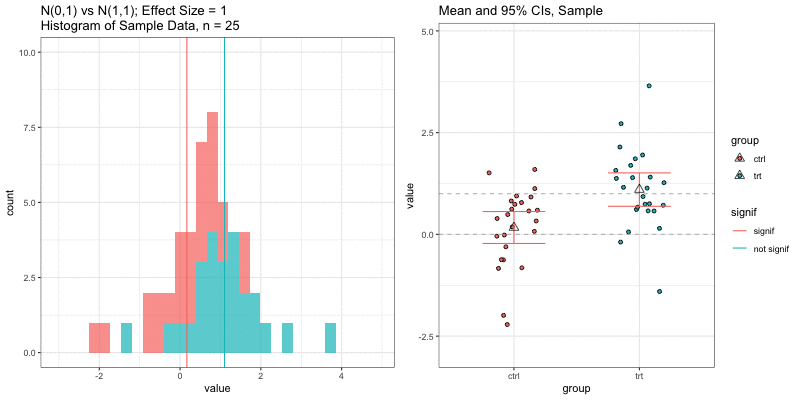
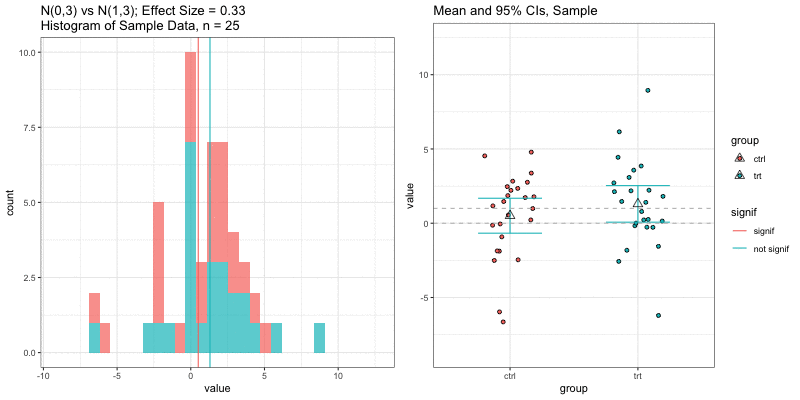

layout: true


---

```{r setup, include=FALSE}
options(htmltools.dir.version = FALSE)

library(tidyverse)

knitr::opts_chunk$set(
  warning=FALSE, 
  message=FALSE, 
  fig.width=10.5, 
  fig.height=4, 
  comment=NA, 
  rows.print=16,
  echo=FALSE)
theme_set(theme_bw(base_size = 24))
```

<!-- Xaringan/css themes stolen from Jennifer Thompson: https://github.com/jenniferthompson/RMedicine2018 Thanks, Jennifer! -->


```{r xaringan-themer, include = FALSE}
# devtools::install_github("gadenbuie/xaringanthemer")
library(xaringanthemer)
mono_light(
  base_color =  "#3A6185", #5e97c9" ## OHSU Marquam, #"#125972" ## picked to coordinate with rOpenSci logo 
  code_highlight_color = "#c0e8f5",
  link_color = "#38BDDE",
  header_font_google = google_font("Josefin Sans"),
  text_font_google   = google_font("Montserrat", "300", "300i"),
  code_font_google   = google_font("Droid Mono"),
  text_font_size = "22px"
)
```

# What are the different kinds of reproducibile research?

> Victoria Stodden, a prominent scholar on this topic, has identified some useful distinctions in reproducible research:

> **Computational reproducibility**: when detailed information is provided about code, software, hardware and implementation details.
>
> **Empirical reproducibility**: when detailed information is provided about non-computational empirical scientific experiments and observations. In practice this is enabled by making data freely available, as well as details of how the data was collected.
>
> **Statistical reproducibility**: when detailed information is provided about the choice of statistical tests, model parameters, threshold values, etc. This mostly relates to pre-registration of study design to prevent p-value hacking and other manipulations.

[ROpenSci Reproducibility Guide](https://ropensci-archive.github.io/reproducibility-guide/)

---

# Goals of sample size and power calculations

- Design a study that will have enough information about underlying population to reject a hypothesis with high confidence.
- Calculate the number of sampling units (e.g. people, animals) you need to estimate statistics with a certain level of precision.
- Sample size is usually referring to biological replicates. Identifying number of technical replicates is a separate question related to measurement error and technical variability (not biological variability).

---

class: middle, center, inverse

# Design your study

---

# Step 1: State your research hypothesis

- Define your:
    + Population
    + Outcome variables/measurements
    + Predictor variables (i.e. treatment, age, genetic mutation)
- Be specific!
- Example: Among *women* (population you sample from), the *BRCA1* mutation
(predictor) is associated with an increased risk of developing *breast cancer* (outcome).
- **Question**: How many women do we need to sample/study to determine that BRCA1 is associated with breast cancer?

## Your hypothesis and design inform your analysis method.

---

# Step 2: Choose your analysis and test(s)

- You can't calculate sample size without knowing which test and model you will use.
- How will you measure your outcome? Continuous? Categorical? Binary (yes/no)?
    + choose outcomes with high sensitivity and low measurement error
- How many groups/experimental conditions/predictors?
    + the more you have the more samples you will need
- What test? t-test? Linear regression? Random effects model? Chi-square test?

## Calculate sample size based on analysis method you will use.

---

class: inverse, center, middle

# Calculate power and sample size

---

# Need to know (/tell your statistician!):

- Overall design (outcome, endpoint, hypothesis)
- Size/magnitude of effect of interest
    + What do you *hope* to detect
- Variability of measurements
    + Precision of your measurement, biological variability within population
- Level of type I error (false positive rate, significance level, $\alpha$)
- Level of power (true positive rate)
- Other design details (number of groups, clustering, repeated measures)

---

# Components of Sample Size

Need to know 3 of the 4 to determine the 4th:

Do We Know? | Measure | Definition
---|---|---
?? | Effect Size | Magnitude of difference or association; <br>i.e. (difference in means)/(population standard deviation) = $\frac{\mu_1 - \mu_0}{\sigma}$ = $\frac{\delta}{\sigma}$
?? | Sample Size | N
0.05, 0.01 | Type I Error / Significance level | $\alpha$ = probability of rejecting null hypothesis when it is true; false positive
0.9, 0.8 | Power  | 1 - $\beta$ = 1 - Type II error = probability of rejecting null hypothesis when it is false; true positive

---

# What is **effect size**?

- Summarizes the outcome of interest
- Magnitude of difference or association
- Specification depends on study design and statistical model/test

---

# Discussion Questions

- How has study design and sample size/power calculations affected the studies you've worked on, were you limited by other factors (i.e. budget, time)?

- Sample size/power calculations are usually not included in manuscripts reporting results, do you think they should be?

- How does "data fishing" contribute to statistical irreproducibility? [xkcd.com/882/](https://xkcd.com/882/)

- How do new and developing technologies (i.e., single cell everything, etc.) make it difficult to design studies that fulfill statistical rigor & reproducibility?

---

# Thought exercise


What details are missing from this sample size description? Could you reproduce it?

> A sample size of 30 is required to have 90% power to detect an effect size of 1.2 with type I error 5%.


---


## Examples:

- Difference in treatment and control mean outcomes, relative to variance (standard deviation)
- Correlation coefficient of two biomarkers
- Risk ratio of breast cancer comparing BRCA carriers to non-carriers
- Magnitude of regression coefficient


---

# Effect size must be

- **pre-specified**
- based on what is meaningful biologically or clinically (not statistical significance)
- based on pilot data or literature review if available

---

# Simple example: T-test

Outcome = Continuous measurement, normal distribution

Predictor = Treatment yes/no (treatment vs control group)

Test: two sample T-test, equal variance

Effect Size: difference in means divided by standard deviation of population $\frac{\mu_{trt} - \mu_{ctrl}}{\sigma}$

Null Hypothesis: Difference in means = 0

Alternative Hypothesis: Difference in means $\neq$ 0

**"Given a desired effect size, what sample size gives us enough information to reject the null hypothesis with power 90%, type I error 5%?"**

---

# Simulations: underlying data distributions

```{r normal_true, fig.width=10, fig.height=6, fig.align='center'}
mu_0 = 0
mu_1 = 1

true_data <- tibble(x=seq(-6,6,by=.005)) %>%
  mutate(ctrl = dnorm(x,mean=mu_0, sd=1),
         trt = dnorm(x, mean=mu_1, sd=1))%>%
  gather(key="group",value="distribution",-x)

ggplot(true_data, aes(fill=group,
                      x=x,
                      y=distribution))+
  geom_line()+
  geom_area(data=true_data%>%filter(group=="ctrl"),alpha=.5)+
  geom_area(data=true_data%>%filter(group=="trt"),alpha=.5)+
  geom_vline(xintercept=mu_0, color="darkred")+
  geom_vline(xintercept=mu_1, color="darkblue")+
  #ylim(0,.5)+
  ylab("distribution = f(x)")+
  annotate(x = -3.5, y=.3,geom="label", label="Effect size = (1 - 0)/1 = 1",size=5)+
  ggtitle("Normal Distributions: N(0,1) vs N(1,1)")
```
---

# n=25, effect size = 1

Power = `r signif(power.t.test(n=25, delta=1, sd = 1, sig.level = 0.05)$power,2)`<br>
(Significance based on two sample t-test for difference in means)

<a href = "https://jminnier-talks.netlify.com/2019_03_samplesizeaacr/img/hist_errorbars_nn25_sd1_mu00_mu11_nsims10.gif">

</a>


---

# R code for t-test, effect size = 1:

```{r, echo = TRUE}
power.t.test(delta = 1, sd = 1, sig.level = 0.05, power = 0.9)
```

---

# n=25, effect size = 0.33

Increase standard deviation from 1 to 3, divides effect size by 3
<br>Power = `r signif(power.t.test(n=25, delta=1, sd = 3, sig.level = 0.05)$power,2)`

<a href = "https://jminnier-talks.netlify.com/2019_03_samplesizeaacr/img/hist_errorbars_nn25_sd3_mu00_mu11_nsims10.gif">

</a>

---

To detect an effect size of 0.33 with power = 0.9 and type I error = 0.05, what sample size would we need? n=194 in each group!

```{r, echo = TRUE}
power.t.test(delta = 0.33, sd = 1, sig.level = 0.05, power = 0.9)
```


---

# n=10, effect size = 1

Decrease sample size<br>
Power = `r signif(power.t.test(n=10, delta=1, sd = 1, sig.level = 0.05)$power,2)`

<a href = "https://jminnier-talks.netlify.com/2019_03_samplesizeaacr/img/hist_errorbars_nn10_sd1_mu00_mu11_nsims10.gif">

</a>

---

# n=3, effect size = 1

Decrease sample size even more<br>Power = `r signif(power.t.test(n=3, delta=1, sd = 1, sig.level = 0.05)$power,2)`

<a href = "https://jminnier-talks.netlify.com/2019_03_samplesizeaacr/img/hist_errorbars_nn3_sd1_mu00_mu11_nsims10.gif">

</a>

---

# n = 3, power = 0.9, effect size = ?

```{r}
eff_size <- power.t.test(n=3, sd=1, sig.level=0.05, power=0.9)$delta/1
glue::glue("")
```

In the `R` output below, the effect size is delta/sd = `r signif(eff_size,3)`/1 = `r signif(eff_size,3)`.

```{r, echo=TRUE}
power.t.test(n=3, sd=1, sig.level=0.05, power=0.9)
```


---

# Underlying data distributions

```{r normal_true3, fig.width=10, fig.height=6, fig.align='center'}
mu_0 = 0
mu_1 = 3.59

true_data <- tibble(x=seq(-6,6,by=.005)) %>%
  mutate(ctrl = dnorm(x,mean=mu_0, sd=1),
         trt = dnorm(x, mean=mu_1, sd=1))%>%
  gather(key="group",value="distribution",-x)

ggplot(true_data, aes(fill=group,
                      x=x,
                      y=distribution))+
  geom_line()+
  geom_area(data=true_data%>%filter(group=="ctrl"),alpha=.5)+
  geom_area(data=true_data%>%filter(group=="trt"),alpha=.5)+
  geom_vline(xintercept=mu_0, color="darkred")+
  geom_vline(xintercept=mu_1, color="darkblue")+
  #ylim(0,.5)+
  ylab("distribution = f(x)")+
  annotate(x = -3.5, y=.3,geom="label", label="Effect size = (3.59 - 0)/1 = 3.59",size=5)+
  ggtitle("Normal Distributions: N(0,1) vs N(3.59,1)")
```


---

# Other reasons to calculate sample size

## Precision of statistics

- Sample sizes can also be calculated for a specific maximum width in confidence interval around an estimate
- i.e. we will estimate the proportion with a 95% confidence interval of width 0.1 such as [0.2, 0.3]

## Prediction models

- Large sample sizes are needed for complex prediction models.
- Stability of prediction model accuracy measures depends on sample size.

---

# Important to remember:

## Sample size estimates are ESTIMATES.

- based on assumptions that could be incorrect
- based on pilot data that could be a poor sample or too small
- the more you don't know, the more conservative you should be (inflate your $n$)
- good to provide multiple estimates for a variety of scenarios/effects

---

# Power Analysis Software

- [G*power](http://www.gpower.hhu.de/), examples of how to use it: http://www.ats.ucla.edu/stat/gpower/
- [TrialDesign.org](http://www.trialdesign.org/index.html)
- [GLIMMPSE](https://glimmpse.samplesizeshop.org/#/)
- [CRAB Stat tools](https://stattools.crab.org/)
- [The Shiny CRT Calculator: Power and Sample size for Cluster Randomised Trials](https://clusterrcts.shinyapps.io/rshinyapp/)
- [Cal Poly Stats Dept Apps](https://statistics.calpoly.edu/shiny)
- [Shiny Dashboard for Sample Size and Power Calculations](https://mfpartridge.shinyapps.io/shinysamplesizesdashboard/)
- [Sealed Envelope](https://www.sealedenvelope.com/) for randomization
- Statistical software such as R, SAS, STATA

# Resources

- [OHSU OCTRI BERD](https://www.ohsu.edu/octri/octri-research-forum-your-monthly-clinical-and-translational-research-event) - Past OCTRI Research Forum Seminars on BERD Topics, recordings SERIES on Power and Sample Size
- [Biostats4You](https://biostats4you.umn.edu/power-sample-size-concepts)

---

class: inverse, center, middle

# Take home message:

## Do your research before you do your research!


---

# Thank you!


Contact me: minnier-[at]-ohsu.edu,  [datapointier](https://twitter.com/datapointier), [jminnier](https://github.com/jminnier/)

Slides available: [https://jminnier-talks.netlify.app/2019_03_samplesizeaacr/2023_05_som_reproducibility_minnier](https://jminnier-talks.netlify.app/2019_03_samplesizeaacr/2023_05_som_reproducibility_minnier)

Slide code available at: [github.com/jminnier/talks-etc](https://github.com/jminnier/talks_etc)


# References

- Some of this talk adapted from: [David Yanez's Sample Size](https://www.ohsu.edu/sites/default/files/2019-12/PowerAndSampleSize_29MAY2019.pdf) talk at [OCTRI BERD Research Forum](https://www.ohsu.edu/octri/octri-research-forum-your-monthly-clinical-and-translational-research-event)
- [Statistical Rules of Thumb, Chapter 2](http://www.vanbelle.org/)
