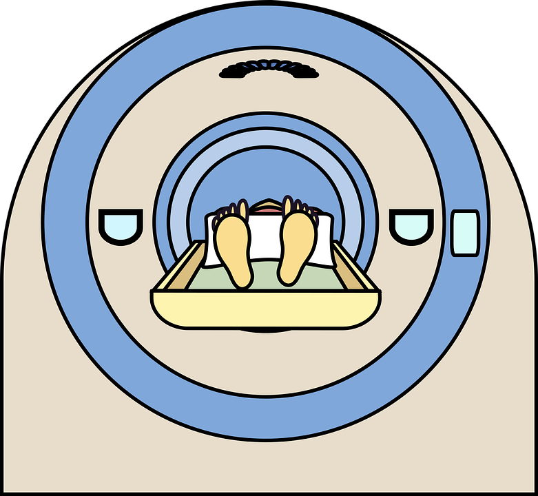
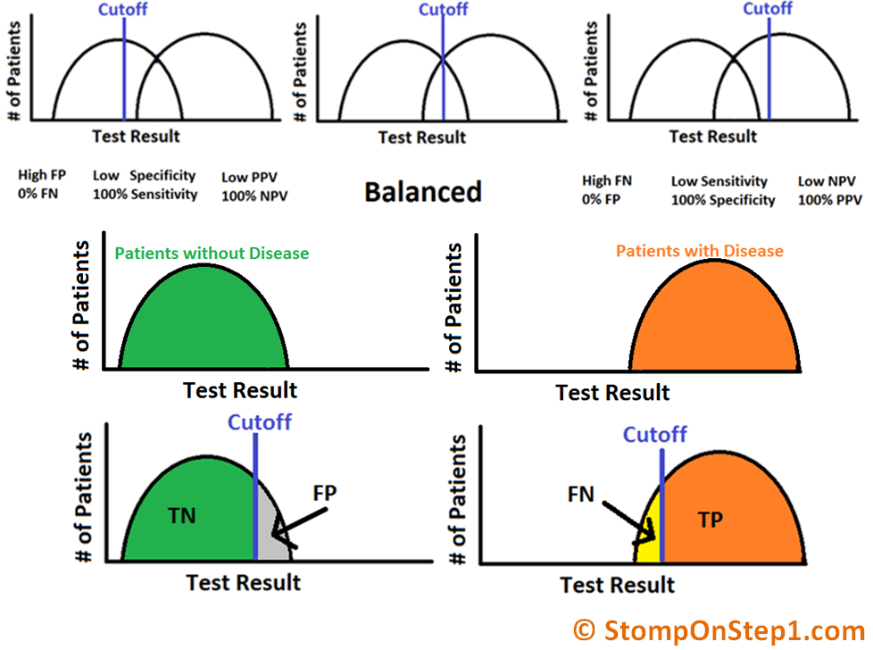
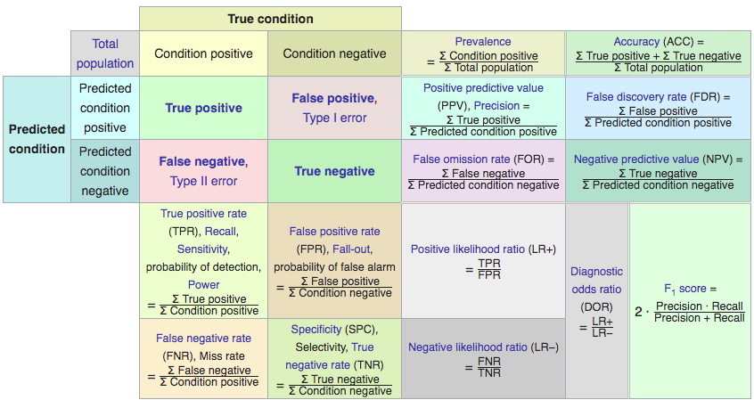
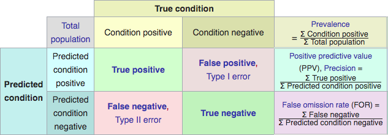
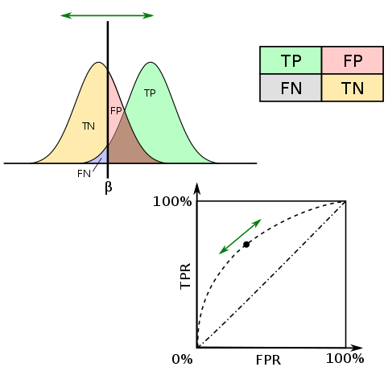
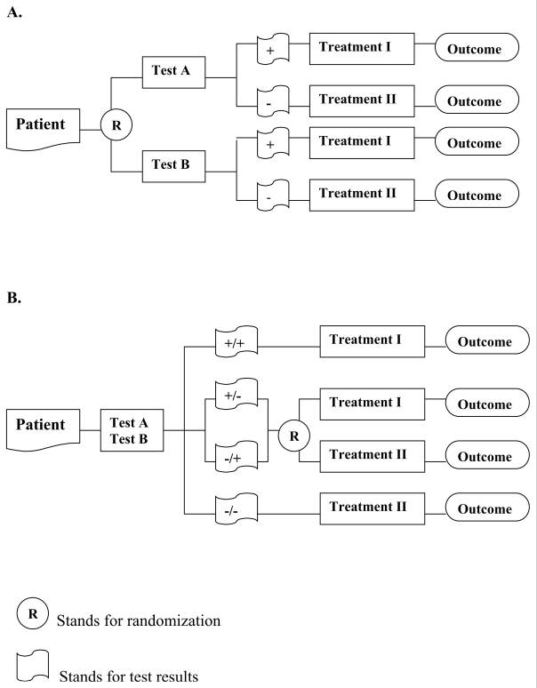
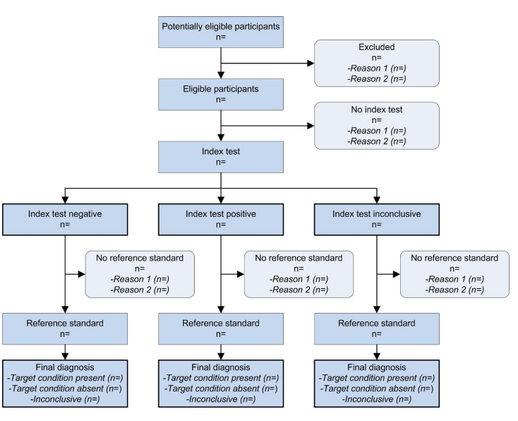
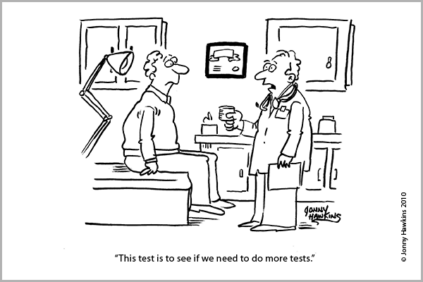

layout: true
  
<!-- <div class="my-footer"><span>bit.ly/jmin-test</span></div>  -->


---

```{r setup, include=FALSE}
options(htmltools.dir.version = FALSE)

library(tidyverse)

knitr::opts_chunk$set(
  warning=FALSE, 
  message=FALSE, 
  fig.width=10.5, 
  fig.height=4, 
  comment=NA, 
  rows.print=16,
  echo=FALSE)
theme_set(theme_bw(base_size = 24))
```


```{r xaringan-themer, include = FALSE}
# devtools::install_github("gadenbuie/xaringanthemer")
library(xaringanthemer)
mono_light(
  base_color =  "#3A6185", #5e97c9" ## OHSU Marquam, #"#125972" ## picked to coordinate with rOpenSci logo 
  code_highlight_color = "#c0e8f5",
  link_color = "#38BDDE",
  header_font_google = google_font("Josefin Sans"),
  text_font_google   = google_font("Montserrat", "300", "300i"),
  code_font_google   = google_font("Droid Mono"),
  text_font_size = "26px",
  outfile = "css/xaringan-themer.css"
  # title_slide_background_image = "img/CAN-RGB-4C-REV.png",
  # title_slide_background_position = "80% 60%",
  # title_slide_background_size = "400px" #"40%"
)
```


class: inverse, middle

# What is a "Diagnostic Test"?

---

## A diagnostic test is a medical test that determines a *target condition*:

- nature or severity of disease (i.e. disease stage)
- risk of future disease condition or event
- response to treatment (actually *"prognostic" test*)


.pull-left-60[
## The medical test may be a

- biomarker
- imaging procedure
- laboratory test
- health history or physical examination
- a combination of the above
- any other method collecting current health information
]
.pull-right-40[
<center><a href="https://pixabay.com/vectors/graphic-mri-scan-test-medical-3455046/"></center>
]
---

# Goals of a diagnostic study may be to determine

- Accuracy of the test to assess disease
- Accuracy of test to predict disease in the future (i.e. within 3 years)
- Reliability or reproducibility of test
- Technical variability of test

We will focus on the first two goals: *accuracy of the test to determine a binary (yes/no) condition in the present or in the future*

---

# Evaluate accuracy, compared to ...?

We need to compare our "index test" of interest to a "reference standard" a.k.a. the "gold standard."

How do we diagnose the disease? The reference standard is the best available method(s).

Example:

- blood sample biomarker (index text) compared to biopsy or imaging (reference standard)
- pregnancy urine test (index test) compared to highly accurate blood test (or ultrasound)

---

# Evaluate accuracy: Statistics 
.pull-left-40[

Continuous (numerical) test $\rightarrow$ must select test positivity cut-off

Or, How to classify disease based on a range of possible test results?

]
<!-- add picture of continuous cut off from distribution -->
.pull-right-60[
<center><a href="http://www.stomponstep1.com/negative-positive-predictive-value-equation-calculation/"></center>
<small>http://www.stomponstep1.com/negative-positive-predictive-value-equation-calculation/</small>
]
---

# Evaluate accuracy: Statistics 

For all possible cut-off values (entire operating characteristic)
- ROC (Receiver Operating Characteristic) curve and AUC (Area Under the Curve)

For a specific cutoff:
- Sensitivity and specificity
- PPV (Positive Predictive Value) and NPV (Negative Predictive Value)

<!-- add picture of continuous cut off from distribution -->


---

## Evaluate accuracy: Statistics 

<center><a href="https://en.wikipedia.org/wiki/Positive_and_negative_predictive_values"></center>

---

.pull-left-60[
## Sensitivity and Specificity

- How does the test perform in people with or without the disease?
- Sensitivity = True Positive Rate (TPR) 
    + Probability someone with the disease tests positive
    + Are we finding the cases?
    + Also called "recall"
- Specificity = True Negative Rate (TNR) in people without the disease
    + Probability someone without the disease tests negative
    + Are we not scaring the healthy people?
- Should be reported together
- Online calculator: [www.medcalc.org/calc/diagnostic_test.php](https://www.medcalc.org/calc/diagnostic_test.php)

]
.pull-right-40[
<center><a href="https://commons.wikimedia.org/wiki/File:Sensitivity_and_specificity.svg"></center>
]


---

## Positive & Negative Predictive Values: PPV, NPV

- How does the test perform in people with positive or negative test values?
- PPV = Probability someone has the disease if they test positive
  + If positive test how likely do I have the disease? (Should I be worried?)
- NPV = Probability someone does not have the disease if they test negative
  + If negative test how likely am I healthy? (Am I reassured?)
- Depends on *prevalence* of disease (if very rare, PPV might be very low)

<center><a href="https://en.wikipedia.org/wiki/Positive_and_negative_predictive_values">
<small>https://en.wikipedia.org/wiki/Positive_and_negative_predictive_values</small></center>

  
---

# ROC Curve

.pull-left[

- Combination of sensitivity & specificity for each possible test positivity cut-off
    + Sensitivity $\approx$ "power"
    + FPR (1-specificity) $\approx$ "significance level" of a test
    + $\to$ ROC plots power vs significance level of a test.
- Useful for comparing multiple tests, but often we only care about the edges (high sensitivity or high specificity)
]
.pull-right[
<center><a href="https://commons.wikimedia.org/wiki/File:ROC_curves_colors.svg"></center>
]

---

# AUC (Area Under the Curve)

.pull-left[
- Area under the ROC Curve
- Single numerical value represents overall accuracy
- *Not* for a specific sensitivity/specificity or cut-off value
- Probability a "case" has a higher test value than a "control" (Can we even sort them?)
- 0.5 is the AUC of a coin flip
]
.pull-right[
<!-- add picture of AUC values -->
<center><a href="https://commons.wikimedia.org/wiki/File:Roc-draft-xkcd-style.svg"></center>
]

---

# Other measures

<center><a href="https://en.wikipedia.org/wiki/Positive_and_negative_predictive_values"></center>

<!-- 2x2 table with other values -->


---

# Accuracy vs. Reproducibility

Does the test accurately diagnose the disease?

vs.

Is the test reproducible over time or over testing system?

- variation in reading imaging
- technical variability in the assay
- limits of detection
- highly variable throughout the day (influenced by fasting, or environment)

---

class: inverse, center, middle

# Designing Studies

---

## Phases in the assessment of diagnostic accuracy

- Phase I (Discovery)
    + Establish technical parameters, algorithms, diagnostic critera
- Phase II (Introductory)
    + Early quantification of performance in clinical settings
- Phase III (Mature)
    + Comparison to other testing modalities in prospective, typically multi-institutional studies (*efficacy*)
- Phase IV (Disseminated)
    + Assessment of the procedure as utilized in the community at large (*effectiveness*)

from [PCORI's "Standards in the Design, Conduct and Evaluation of Diagnostic Testing
For Use in Patient Centered Outcomes Research" (2012)](https://www.pcori.org/assets/Standards-in-the-Design-Conduct-and-Evaluation-of-Diagnostic-Testing-for-Use-in-Patient-Centered-Outcomes-Research.pdf)

---

## Diagnostic studies

- Observational trials to determine accuracy
  + less costly
  + may have unidentified biases, may lack all information to inform test
- Randomized trials to assess accuracy and/or efficacy
  + minimizes selection bias/confounding, prospective design minimizes temporal ambiguity
  + expensive, homogeneous population
- Randomized trials to incorporate an intervention
  + Who receives the intervention?
  
Pepe, M. S., et al (2008). [Pivotal evaluation of the accuracy of a biomarker used for classification or prediction: standards for study design.](https://academic.oup.com/jnci/article/100/20/1432/900265) Journal of the National Cancer Institute, 100(20), 1432-1438.
---


.pull-left[
# Randomized Studies

- Example of randomizing to test vs randomizing to treatment:
- Paired (B) design more efficient

<small>Lu B, Gatsonis C. Efficiency of study designs in diagnostic randomized clinical trials. Stat Med. 2013;32(9):1451–1466. doi:10.1002/sim.5655</small>
]
.pull-right[
<center><a href="https://www.ncbi.nlm.nih.gov/pmc/articles/PMC3600406/"></center>
]

---

# Sample Size and Power

What is the outcome/effect size measure?

- Compare AUC to gold standard - new test and reference standard on same population
    + Need to know AUC of gold standard, proposed test's AUC, prevalence, correlation of two tests within case and control patients
- Compare sensitivity and specificity of a binary test = binomial proportion calculator
    
Software: [PASS](https://ncss-wpengine.netdna-ssl.com/wp-content/themes/ncss/pdf/Procedures/PASS/Tests_for_Two_ROC_Curves.pdf), R package [pROC](https://www.rdocumentation.org/packages/pROC/versions/1.15.3/topics/power.roc.test)

<small>Moskowitz, C. S., & Pepe, M. S. (2006). Comparing the predictive values of diagnostic tests: sample size and analysis for paired study designs. Clinical Trials, 3(3), 272–279. https://doi.org/10.1191/1740774506cn147oa</small>
---

class: inverse, center, middle

# Reporting results

---

# Reporting standards

.pull-left-40[
- Standards for Reporting of Diagnostic Accuracy (STARD) https://www.equator-network.org/reporting-guidelines/stard/
- Confidence intervals around AUC, sensitivity, specificity, etc. to quantify statistical precision of measurements.
]
.pull-right-60[
<center><a href="https://www.equator-network.org/reporting-guidelines/stard/"></center>
]


---

### References and Resources

- Carlos, R., et al (2012). Standards in the Design, Conduct and Evaluation of Diagnostic Testing for Use in Patient Centered Outcomes Research. PCORI.
https://www.pcori.org/assets/Standards-in-the-Design-Conduct-and-Evaluation-of-Diagnostic-Testing-for-Use-in-Patient-Centered-Outcomes-Research.pdf
- Lu B, Gatsonis C. Efficiency of study designs in diagnostic randomized clinical trials. Stat Med. 2013;32(9):1451–1466. [doi:10.1002/sim.5655](https://www.ncbi.nlm.nih.gov/pmc/articles/PMC3600406/)
Moskowitz, C. S., & Pepe, M. S. (2006). Comparing the predictive values of diagnostic tests: sample size and analysis for paired study designs. Clinical Trials, 3(3), 272–279. [doi.org/10.1191/1740774506cn147oa](https://doi.org/10.1191/1740774506cn147oa)
- Pepe, M. S., et al (2008). [Pivotal evaluation of the accuracy of a biomarker used for classification or prediction: standards for study design.](https://academic.oup.com/jnci/article/100/20/1432/900265) JNCI, 100(20), 1432-1438.
- PCORI's Standards for Studies of Diagnostic Tests curriculum:
https://www.pcori.org/research-results/about-our-research/research-methodology/methodology-standards-academic-curriculum-7

---
class: inverse

# Thank you!

.pull-left-40[
Contact me: 
`r icon::fa("envelope")` minnier-[at]-ohsu.edu, `r icon::fa("twitter")` [datapointier](https://twitter.com/datapointier), `r icon::fa("github")` [jminnier](https://github.com/jminnier/)

Slides available: [bit.ly/jmin-test](https://bit.ly/jmin-test)

Slide code and files available at: [github.com/jminnier/talks-etc](https://github.com/jminnier/talks_etc)

]
.pull-right-60[
<center><a href="https://www.empr.com/slideshow/slides/cartoons-3-10-2013/"><br></a></center>
]
