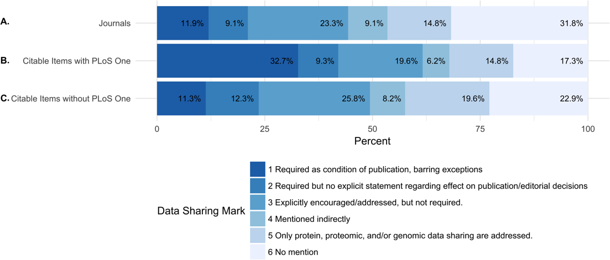
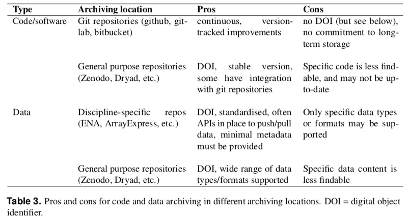

layout: true


---

```{r setup, include=FALSE}
options(htmltools.dir.version = FALSE)

library(tidyverse)

knitr::opts_chunk$set(
  warning=FALSE, 
  message=FALSE, 
  fig.width=10.5, 
  fig.height=4, 
  comment=NA, 
  rows.print=16,
  echo=FALSE)
theme_set(theme_bw(base_size = 24))

library(RefManageR)
BibOptions(check.entries = FALSE,
           bib.style = "authoryear",
           cite.style = "alphabetic",
           style = "markdown",
           hyperlink = FALSE,
           dashed = FALSE)
myBib <- ReadBib("./minnier_bibliography.bib", check = FALSE)
#Citet(myBib, key="peng2011reproducible")
#citeNatbib(key="peng2011reproducible", bib=myBib, textual = TRUE)
```

```{r xaringan-themer, include = FALSE}
# creates xaringan theme
# devtools::install_github("gadenbuie/xaringanthemer")
library(xaringanthemer)
mono_light(
  base_color =  "#3A6185", ## OHSU Marquam
  code_highlight_color = "#cbdded",
  link_color = "#38BDDE",
  header_font_google = google_font("Josefin Sans"),
  text_font_google   = google_font("Montserrat", "300", "300i","400i","700"),
  code_font_google   = NULL,
  text_font_size = "22px",
  code_font_size = "18px",
  header_h1_font_size = "45px",
  header_h2_font_size = "40px",
  header_h3_font_size = "35px",
  padding = "0em 2em 1em 2em",
  outfile = "css/xaringan-themer.css"
)
```


# Introduction

<center><a href="https://zenodo.org/record/3695300#.XsRP6BNKgqI"><br>Illustrations from the Turing Way book dashes; This image was created by Scriberia for The Turing Way community and is used under a CC-BY licence</a></center>

---

# Goals

- Define reproducible research
- Important components of reproducibility
- Relevance to data science and analysis
- Introduction to version control
- Introduction to literate programming in R

---

# What is Reproducible Research?


.pull-left[
<center><a href="https://www.biorxiv.org/content/10.1101/066803v1.full"><br>Patil, Peng, & Leek 2016</a></center>
]
.pull-right[
**Reproducibility:** ability to recompute data analytic results given the dataset and knowledge of the data analysis pipeline

**Replicability:** the chance that an independent experiment targeting the same scientific question will produce a consistent result

-- `r Cite(key="peng2011reproducible", bib=myBib, textual = TRUE, .opts=list(cite.style="authoryear"))` "Reproducible research in computational science" and `r Cite(key="Leek:2015aa", bib=myBib, textual = TRUE, .opts=list(cite.style="authoryear"))` "Opinion: Reproducible research can still be wrong: Adopting a prevention approach"
]

---
<center><a href="https://zenodo.org/record/3695300#.XsRP6BNKgqI"><br>Illustrations from the Turing Way book dashes; This image was created by Scriberia for The Turing Way community and is used under a CC-BY licence</a></center>

---

# Reproducible = Replicable + Transparant

> Research results are **replicable** if there is sufficient information available for independent researchers to make the same findings using the same procedures.
>
> In **computational sciences this means**: the data and code used to make a finding are available and they are sufficient for an independent researcher to recreate the finding.
>
> In practice, research needs to be **easy for independent researchers to reproduce**.
>

-- `r Cite(key=c("king1995replication","ball2012teaching"), bib=myBib, textual = TRUE, .opts=list(cite.style="authoryear"))` from `r Cite(bib=myBib,key="gandrud2013reproducible",textual=TRUE, .opts=list(cite.style="authoryear"))`

> **Replicability** has been a key part of scientific inquiry from perhaps the 1200s. It has even been called the "demarcation between science and non-science."
>

-- `r Cite(bib=myBib,key="gandrud2013reproducible",textual=TRUE, .opts=list(cite.style="authoryear"))` book "Reproducible Research with R and R Studio" and references therein, including [Roger Bacon's "Opera quaedam hactenus inedita Vol. 1" from 1267](https://books.google.com/books?id=wMUKAAAAYAAJ)


---

# What are the different kinds of reproducibile research?

> Victoria Stodden, a prominent scholar on this topic, has identified some useful distinctions in reproducible research:

> **Computational reproducibility**: when detailed information is provided about code, software, hardware and implementation details.
>
> **Empirical reproducibility**: when detailed information is provided about non-computational empirical scientific experiments and observations. In practise this is enabled by making data freely available, as well as details of how the data was collected.
>
> **Statistical reproducibility**: when detailed information is provided about the choice of statistical tests, model parameters, threshold values, etc. This mostly relates to pre-registration of study design to prevent p-value hacking and other manipulations.

[ROpenSci Reproducibility Guide](http://ropensci.github.io/reproducibility-guide/sections/introduction/)

---

# Spectrum of Research

> [Stodden et al. (2013)](http://stodden.net/icerm_report.pdf) place computational reproducibility on a spectrum with five categories that account for many typical research contexts:
>
> - Reviewable research: The descriptions of the research methods can be independently assessed and the results judged credible. (This includes both traditional peer review and community review, and does not necessarily imply reproducibility.)
> - Replicable research: Tools are made available that would allow one to duplicate the results of the research...
> - Confirmable research: ... main conclusions of the research can be attained independently without the use of software provided by the author ...
> - Auditable research: Sufficient records (including data and software) have been archived ...
> - Open or Reproducible research: Auditable research made openly available. This comprised well-documented and fully open code and data that are publicly available that would allow one to (a) fully audit the computational procedure, (b) replicate and also independently reproduce the results of the research, and (c) extend the results or apply the method to new problems.

[ROpenSci Reproducibility Guide](http://ropensci.github.io/reproducibility-guide/sections/introduction/)

---

# Reproducibility in Data Science

> "Reproducibility is important because it is the **only thing that an investigator can guarantee about a study.**"
> 
> "**a study can be reproducible and still be wrong**"
>
> "These days, with the complexity of data analysis and the subtlety of many claims (particularly about complex diseases), reproducibility is pretty much the only thing we can hope for. Time will tell whether we are ultimately right or wrong about any claims, but **reproducibility is something we can know right now**."
> 
> "By using the word reproducible, I mean that the **original data (and original computer code) can be analyzed (by an independent investigator) to obtain the same results of the original study**. In essence, it is the notion that the data analysis can be successfully repeated. Reproducibility is particularly important in large computational studies where the data analysis can often play an outsized role in supporting the ultimate conclusions."

-- Roger Peng's 2014 blog post on Simply Statistics ["The Real Reason Reproducible Research is Important"](http://simplystatistics.org/2014/06/06/the-real-reason-reproducible-research-is-important/)
also see `r Cite(bib=myBib,key="peng2011reproducible",textual=TRUE, .opts=list(cite.style="authoryear"))` "Reproducible research in computational science"

---

# Early notions of reproducibility: "Claerbout's Principle"

>  An article about computational science in a scientific publication is not the scholarship itself, it is merely advertising of the scholarship. The actual scholarship is the complete software development environment and the complete set of instructions which generate the figures.


> It takes **some effort to organize your research to be reproducible**.
>
>We found that although the effort seems to be directed to helping other people stand up on your shoulders, the principal beneficiary is generally the author herself.
>
>This is because time turns each one of us into another person, and by making effort to communicate with strangers, we help ourselves to communicate with our **future selves**.


- `r Cite(bib=myBib,key="claerbout1992electronic",textual=TRUE, .opts=list(cite.style="authoryear"))` "Electronic documents give reproducible research a new meaning"
- `r Cite(bib=myBib,key="buckheit1995wavelab",textual=TRUE, .opts=list(cite.style="authoryear"))` "Wavelab and reproducible research"
- `r Cite(key="schwab2000making", bib=myBib, textual = TRUE, .opts=list(cite.style="authoryear"))` "Making scientific computations reproducible"
- `r Cite(bib=myBib,key="de2001reproducible",textual=TRUE, .opts=list(cite.style="authoryear"))` "Reproducible research. the bottom line"


> (Jon F. Claerbout is the Cecil Green Professor Emeritus of Geophysics at Stanford University. He was one of the first scientists to emphasize that computational methods threaten the reproducibility of research unless open access is provided to both the data and the software underlying a publication.) 


---
class: middle, center, inverse

# Current Issues and Discussion

---


# How to Make More Published Research True

`r Cite(bib=myBib,key="ioannidis2014make",textual=TRUE, .opts=list(cite.style="authoryear"))` "How to Make More Published Research True" in PLOS Medicine, the author writes a follow up to `r Cite(bib=myBib,key="ioannidis2005most",textual=TRUE, .opts=list(cite.style="authoryear"))` "Why most published research findings are false."

He suggests reproducibility as one key component to the cause:

> "To make more published research true, practices that have improved credibility
and efficiency in specific fields may be transplanted to others which would
benefit from them—possibilities include
> 
> - the adoption of large-scale collaborative
research;
> - **replication culture**;
> - registration; sharing; **reproducibility practices**;
> - better statistical methods;
> - standardization of definitions and analyses;
> - more appropriate (usually more stringent) statistical thresholds; and
> - improvement in study design standards, peer review, *reporting and dissemination of
research*, and training of the scientific workforce."


---


# Availability of code in peer-reviewed journals

`r Cite(bib=myBib,key="stodden2013toward",textual=TRUE, .opts=list(cite.style="authoryear"))` "Toward Reproducible Computational Research: An
Empirical Analysis of Data and Code Policy Adoption by
Journals"


- studied change in policies between 2011-2012
- open data and code policy adoption ~  impact factor and publisher
- higher impact journals more likely to have open data and code policies
- scientific societies more likely to have open data and code policies than commercial publishers.

---

# Data sharing requirements

`r Cite(bib=myBib,key="Vasilevsky_2017",textual=TRUE, .opts=list(cite.style="authoryear"))` ["Reproducible and reusable research: are journal data sharing policies meeting the mark?"](https://peerj.com/articles/3208/)

<center></center>
---

# Data sharing requirements

`r Cite(bib=myBib,key="Vasilevsky_2017",textual=TRUE, .opts=list(cite.style="authoryear"))` ["Reproducible and reusable research: are journal data sharing policies meeting the mark?"](https://peerj.com/articles/3208/)

.pull-left[
<center></center>
]
.pull-right[
<center></center>
]

---

# Data management: FAIR principles (Findable, Accessible, Interoperable, Reusable)

.pull-left[
- Make data available in trusted data repository
- Include comprehensive metadata
- Store in open (non-proprietary) formats
- Attach a permanent identifier (i.e. DOI)

In Biomedical research, open access can be difficult/unethical.

`r Cite(bib=myBib,key="Wilkinson_2016",textual=TRUE, .opts=list(cite.style="authoryear"))` 

]
.pull-right[
<center><br><a href="https://zenodo.org/record/3695300#.XsRP6BNKgqI"><br>Illustrations from the Turing Way book dashes; This image was created by Scriberia for The Turing Way community and is used under a CC-BY licence</a></center>
]

---


# NIH requirements (beginning Jan 2016, updated Jan 2019)

["Enhancing Reproducibility through Rigor and Transparency"](http://grants.nih.gov/grants/guide/notice-files/NOT-OD-15-103.html)

1. *Rigor of the Prior Research*
    + "describe the general strengths and weaknesses of the prior research being cited by the investigator as crucial to support the application." 
    + experimental design/power of prior studies used for hypothesis generation, weaknesses include different populations/species, unblinded, not adjusting for confounders
2. *Rigorous Experimental Design*
3. *Consideration of Sex and Other Relevant Biological Variables*
    + "sex is a biological variable that is frequently ignored in animal study designs and analyses"
4. *Authentication of Key Biological and/or Chemical Resources*
5. *Implementation*

[NIH "Rigor and Reproducibility" Policy](http://grants.nih.gov/reproducibility/index.htm)

*Note:* Most of this is in regards to the science, design of experiment, chemical and biological methods. Essentially no language describing reproducibility of analyses or data management for data or results generated by the grant.


---

# Journals unite with NIH to encourage reproducibility

- [Principles and Guidelines for Reporting Preclinical Research](http://www.nih.gov/research-training/rigor-reproducibility/principles-guidelines-reporting-preclinical-research)
- NIH held a joint workshop in June 2014 with the Nature Publishing Group and Science on the issue of reproducibility and rigor of research findings
- A video/slide presentation about this topic and how it applies to grant applications and peer review can be found here:
[NIH Policy Rigor for Reviewers Presentation](http://grants.nih.gov/grants/policy/rigor/NIH_Policy_Rigor_For_Reviewers/presentation.html)

---

# NIH [Principles and Guidelines for Reporting Preclinical Research](http://www.nih.gov/research-training/rigor-reproducibility/principles-guidelines-reporting-preclinical-research)

Journals should aim to facilitate the interpretation and repetition of experiments as they have been conducted in the published study.

- include policies for statistical reporting in information to authors
- no limits or generous limits for methods sections
- should use a **checklist** during editorial processing to ensure the reporting of key methodological and analytical information to reviewers and readers
- Data and material sharing
    + at the minimum, data sets on which the conclusions of the paper rely must be made available upon request (where ethically appropriate) during consideration of the manuscript (by editors and reviewers) and upon reasonable request immediately upon publication.
    + Recommend deposition of data sets in public repositories, where available
    + Encourage presentation of all other data values in machine readable format 
    + Encourage sharing of software and require at the minimum a statement in the manuscript describing if software is available and how it can be obtained.
- journal assumes responsibility to consider publication of refutations of that paper
- best practice guidelines for image based data and a description of biological material with enough information to uniquely identify the reagents
- do not obviate need for biological replication/validation


 
---
 
# Checklist: authors required to report

from [NIH Guidelines](http://www.nih.gov/research-training/rigor-reproducibility/principles-guidelines-reporting-preclinical-research) & `r Cite(bib=myBib,key="Landis_2012",textual=TRUE, .opts=list(cite.style="authoryear"))` ["A call for transparent reporting to optimize the predictive value of preclinical research"](https://www.nature.com/articles/nature11556)

- *Standards:* community-based standards (nomenclature etc) where applicable
- *Replicates:* report how often each experiment was performed, whether results were substantiated by repetition under a range of conditions. Sufficient information about sample collection must be provided to distinguish between independent biological data points & technical replicates.
- *Statistics:* Require statistics to be fully reported in the paper, including statistical test used, exact value of N, definition of center, dispersion & precision measures
- *Randomization:*  (yes/no) & method, at a minimum for all animal experiments
- *Blinding:* were experimenters blind to group assignment & outcome assessment, at a minimum for all animal experiments.
- *Sample-size (SS) estimation:* was an appropriate SS computed during study design & include method; if no power analysis, how was SS determined?
- *Inclusion and exclusion criteria:* criteria used for exclusion of any data or subjects. Include any similar experimental results that were omitted from reporting for any reason, esp. if results don't support main findings of study; describe any outcomes/conditions that are measured/used & not reported in results section.


---
# Reproducible research and Biostatistics (the journal)

> Authors should submit the following:
> 
> 1. A “main” script which directs the overall analysis. This script may load data, other software, and call the necessary functions for conducting the analysis described in the article.
> 2. Other required code files, presumably called from the “main” script file.
> 3. External data or auxiliary files containing the analytic data sets or other required information.
> 4. A “target” file (or files) containing the results which are to be reproduced. Such a file could consist
of an ASCII text file containing numerical results or a PDF file containing a figure. This will aid in the comparison of computed results with published results.
>
> Although not required, authors are encouraged to use literate programming tools [...]

-- `r Cite(bib=myBib,key="peng2009reproducible",textual=TRUE, .opts=list(cite.style="authoryear"))` "Reproducible research and *Biostatistics*"

>Our reproducible research policy is for papers in the journal to be kite-marked D if the data on which they are based are freely available, C if the authors' code is freely available, and R if both data and code are available, and our Associate Editor for Reproducibility is able to use these to reproduce the results in the paper. Data and code are published electronically on the journal's website as Supplementary Materials.

---


# Nature series on "Challenges in Irreproducible Research"

Nature has a website containing editorials, features, news, and articles on various topics related to reproducibile research:
[Nature special: Challenges in Irreproducible Research](http://www.nature.com/news/reproducibility-1.17552)

Including

- [a checklist for authors of Nature papers](http://www.nature.com/authors/policies/checklist.pdf)
described in the 2013 announcement ["Announcement: Reducing our irreproducibility"](http://www.nature.com/news/announcement-reducing-our-irreproducibility-1.12852) 
- R Nuzzo (2014) Nature News Feature ["Scientific method: Statistical errors"](http://www.nature.com/news/scientific-method-statistical-errors-1.14700) on
"P values, the 'gold standard' of statistical validity, are not as reliable as many scientists assume." 

---

# Nature series on "Challenges in Irreproducible Research"

- May 25, 2016 Editorial ["Reality check on reproducibility"](http://www.nature.com/news/reality-check-on-reproducibility-1.19961)

.pull-left-40[

]
.pull-right-60[
> One-third of survey respondents report that they have taken the initiative to improve reproducibility. The simple presence of another person ready to **question** whether a data point or a sample should really be excluded from analysis can help to cut down on cherry-picking, conscious or not. A couple of senior scientists have set up **workflows** that avoid having a single researcher in charge of preparing images or collecting results. Dozens of respondents reported steps to make **better use of statistics, randomization or blinding**. One described an institution-level initiative to **teach scientists computer tools so they could share and analyse data collaboratively**. Key to success was making sure that their **data-management system also saved time**.
]
---
class: inverse, middle, center

# Reproducibility in Practice

---

# Data management

- Write a data management plan prior to research, should cover entire project lifestyle
- Follow the FAIR principles when possible
- Document, document, document! (metadata, create Readme file)
- For open data, attach a licence or rights waiver
- DOI or Zenodo identifiers to capture open data at specific time points
- For private/patient data, access should be granted based on data sharing agreement; version control and data storage principles should still be followed for internal reproducibility and traceability; code can still be shared

>"The basics of RDM [Research Data Managment] that should be applied to every research project include: i) storing data carefully and securely (according to the appropriate standards in the case of sensitive data), ii) backing up frequently and in at least two separate locations, and iii) using a file naming convention so that others within and outside a project can understand a file’s content."

Kunzmann et al (PeerJ as preprint soon) "Realistic and Robust Reproducible Research for Biostatistics"

Resources:
- [DMPonline](https://dmponline.dcc.ac.uk/) by the Digital Curation Centre for writing data management plans
- [FAQs for Enabling FAIR Data](http://www.copdess.org/enabling-fair-data-project/enabling-fair-data-faqs/)
- LabKey, open-source specimen and data managment platform

---

# Software, workflow, and dependency management

Problems:

- Software changes, new versions are released and older code breaks.
- Files are removed or moved and all the code breaks.
- One file is updated but the rest of the code/files are not updated.
- You forgot which files depend on which other files, or what has been changed.

Solutions for Workflow:

- **Automation** streamlined automation and documentation of the research process, e.g. editing files, moving input and output between different parts of your workflow, and compiling documents for publication (shell programs, `make`); in python: snakemake, in R: drake

Solutions for Dependency:

- **Preservation** of the environment (code, data, software) with virtualisation, i.e. Docker, VMware, VirtualBox, packrat for R package management

[ROpenSci Reproducibility Guide](http://ropensci.github.io/reproducibility-guide/sections/introduction/)

---

# Archiving and citability

- Long-term availability of code and data
- Popular repositories for data: Zenodo, Dryad, Genbank, GEO
- Popular repositories for code: GitHub, bitbucket, Bioconductor, CRAN PyPI
- Citability: Digital Object Identifier (DOI) for code and data

<center><br>Kunzmann et al (PeerJ as preprint soon) "Realistic and Robust Reproducible Research for Biostatistics"</center>


---


# Literate Programming

.pull-left[
> Literate programming is an approach to programming introduced by Donald Knuth in which a program is given as an explanation of the program logic in a natural language, such as English, interspersed with snippets of macros and traditional source code, from which a compilable source code can be generated. `r Cite(bib=myBib,key="knuth1984literate",textual=FALSE, .opts=list(cite.style="authoryear"))` 

Examples: [knitr](http://yihui.name/knitr/) (for R), Sweave; Jupyter notebooks (for python) [SASweave](http://homepage.cs.uiowa.edu/~rlenth/SASweave/), Statrep (for SAS); [StatWeave](http://homepage.stat.uiowa.edu/~rlenth/StatWeave/) (for STATA)
]
.pull-right[
This is knitr (presentation made with knitr+RStudio):

```{r, message=FALSE, warning=FALSE, echo=TRUE}
library(survival)
leukemia.surv <- survfit(Surv(time, status) ~ x, data = aml) 
plot(leukemia.surv, lty = 2:3) 
legend(100, .9, c("Maintenance", "No Maintenance"), lty = 2:3) 
title("Kaplan-Meier Curves\nfor AML Maintenance Study")
```
]

---

# Version Control

.pull-left[

- A system that tracks and records changes to file(s)
- Allows for collaborative work on code
- i.e. **git**: "a lightweight yet
robust framework that is ideal for managing the full suite of research outputs such as datasets, statistical code, figures, lab notes, and manuscripts." `r Cite(bib=myBib,key="ram2013git",textual=TRUE, .opts=list(cite.style="authoryear"))` "Git can facilitate greater reproducibility and increased transparency in science."
- online git respositories include: GitHub, bitbucket, GitLab
- more sophisticated/lightweight than track changes in Word/google docs

Resources:
- [Software Carpentry "Version Control w/Git"](https://swcarpentry.github.io/git-novice/)
- [Github tutorials](https://try.github.io/)
- [Happy Git and GitHub for the useR - Jenny Bryan, Jim Hester](https://happygitwithr.com/)
]
.pull-right[
<center><a href="https://zenodo.org/record/3695300#.XsRP6BNKgqI"><br>Illustrations from the Turing Way book dashes; This image was created by Scriberia for The Turing Way community and is used under a CC-BY licence</a></center>
]
---


.pull-left-60[
# Why Use Version Control?
<center><a href="https://zenodo.org/record/3695300#.XsRP6BNKgqI"><br>Illustrations from the Turing Way book dashes; This image was created by Scriberia for The Turing Way community and is used under a CC-BY licence</a></center>
]
.pull-right-40[
<br><center><a href="http://www.phdcomics.com"><br>PhD Comics by Jorge Cham</a></center>
]

---

# Why Use Version Control?

> Have you ever:
>
> - Made a change to code, realised it was a mistake and wanted to revert back?
> - Lost code or had a backup that was too old?
> - Had to maintain multiple versions of a product?
> - Wanted to see the difference between two (or more) versions of your code?
> - Wanted to prove that a particular change broke or fixed a piece of code?
> - Wanted to review the history of some code?
> - Wanted to submit a change to someone else's code?
> - Wanted to share your code, or let other people work on your code?
> - Wanted to see how much work is being done, and where, when and by whom?
> - Wanted to experiment with a new feature without interfering with working code?
> 
> In these cases, and no doubt others, **a version control system should make your life easier.**

[Stack Overflow question: Why should I use version control?](http://stackoverflow.com/questions/1408450/why-should-i-use-version-control)

---
class: center, middle, inverse

# Make a Plan

---

# Checklists for Reproducibility

- ["Checklists work to improve science"](https://www.nature.com/articles/d41586-018-04590-7) - Nature editorial, April 2018
- In 2013, *Nature* announced that authors submitting manuscripts to *Nature* journals would need to complete a checklist addressing key factors underlying irreproducibility for reviewers and editors to assess during peer review
- Survey of researchers who had published in a Nature journal between July 2016 and march 2017

> Of the 480 who responded, 49% thought that the checklist had improved the quality of research published in Nature (15% disagreed); 37% thought the checklist had improved quality in their field overall (20% disagreed).

Checklists can be useful for computational research in general.

An excellent example: [ROpenSci's Reproducibility Checklist](http://ropensci.github.io/reproducibility-guide/sections/checklist/)

---
.pull-left[
## Barriers to Reproducibility/Replicability

- Selective reporting of results
- Pressure to publish
- Not robust results
- Protocols, computer code, or reagent info insufficient or not available

## Barriers to implementing R&R

- insufficient funding/time
- insufficient training (and funding for training)
- journals/funders do not have clear guidelines or priorities
- open access not encouraged or funded

]
.pull-right[
<br>
<center><a href="https://media.nature.com/original/magazine-assets/d41586-018-04590-7/15675426"><br>Nature Survey 2017 results</a></center>
]

---

# Example ideals for a computational group

- Literate programming
- Best practices for writing code (i.e. [ROpenSci's Reproducibility & Writing Code Guide](http://ropensci.github.io/reproducibility-guide/sections/writingCode/) and "Best Practices for Scientific Computing" `r Cite(bib=myBib,key="wilson2014best",textual=TRUE, .opts=list(cite.style="authoryear"))` 
- use html web-based output
    + [see Matthew Shotwell's slides](http://biostatmatt.com/uploads/shotwell-interface-2011.pdf)
    + nearly universal compatibility
    + persistent
    + images handled more naturally
- use `make` files to rerun analyses when certain files change
- version/revision control systems such as git for all files
- version control of data
- Software/package versions need to be maintained (i.e. packrat for R)


---

# "Ten Simple Rules for Reproducible Computational Research"

- Rule 1: For Every Result, Keep Track of How It Was Produced
- Rule 2: Avoid Manual Data Manipulation Steps
- Rule 3: Archive the Exact Versions of All External Programs Used
- Rule 4: Version Control All Custom Scripts
- Rule 5: Record All Intermediate Results, When Possible in Standardized Formats
- Rule 6: For Analyses That Include Randomness, Note Underlying Random Seeds
- Rule 7: Always Store Raw Data behind Plots
- Rule 8: Generate Hierarchical Analysis Output, Allowing Layers of Increasing Detail to Be Inspected
- Rule 9: Connect Textual Statements to Underlying Results
- Rule 10: Provide Public Access to Scripts, Runs, and Results

`r Cite(bib=myBib,key="sandve2013ten",textual=TRUE, .opts=list(cite.style="authoryear"))` 

---
class:center, middle, inverse

# Brief Tutorials

---

# R Markdown/Knitr (literate programming)

- BERD workshop "Reproducible Reports with R Markdown" slides: [bit.ly/berd_rmd](http://bit.ly/berd_rmd)
and recording [link](https://echo360.org/section/aefe4e1c-c635-4a3b-bf99-ce6439184f5f/public) and other info is found on [github](https://github.com/jminnier/berd_r_courses)
- Example, new git project in Rstudio
- Example, cloning a github repo

---

# Git/github (version control)

- Using git in Rstudio (for more instruction, highly recommend [happygitwithr.com](https://happygitwithr.com/))
- Explore an example GitHub repo [OHSU-Library/Biomedical_Journal_Data_Sharing_Policies](https://github.com/OHSU-Library/Biomedical_Journal_Data_Sharing_Policies)

---
class:center, middle, inverse

# Resources

---

## Recommended Books

- [Stodden, Victoria, Friedrich Leisch, and Roger D. Peng, eds. Implementing reproducible research. CRC Press, 2014.](https://www.crcpress.com/Implementing-Reproducible-Research/Stodden-Leisch-Peng/9781466561595)
- [Gandrud, Christopher. Reproducible Research with R and R Studio. CRC Press, 2013.](https://www.crcpress.com/Reproducible-Research-with-R-and-R-Studio/Gandrud/9781466572843)
- [Xie, Yihui. Dynamic Documents with R and knitr. Vol. 29. CRC Press, 2013.](https://www.crcpress.com/Dynamic-Documents-with-R-and-knitr/Xie/9781482203530)

## Online classes

- Karl Broman's class "Tools for Reproducible Research" at UWisconsin-Madison <http://kbroman.org/Tools4RR/>
- "Reproducible Research" by Johns Hopkins on Coursera (Peng, Leek, Caffo)
<https://www.coursera.org/learn/reproducible-research>
- Learn git: <https://try.github.io/levels/1/challenges/1>

## NIH Rigor & Reproducibility Resources

- Website: <http://grants.nih.gov/reproducibility/index.htm>
- FAQs: <http://grants.nih.gov/reproducibility/faqs.htm>
- NIH Training Module: <https://grants.nih.gov/reproducibility/module_1/presentation.html>

---

## Websites/slides/blogs

- ROpenSci's "Reproducibility in Science" [guide](http://ropensci.github.io/reproducibility-guide/)
including the [reproducibility checklist](http://ropensci.github.io/reproducibility-guide/sections/checklist)
- Victoria Stodden's [list of talks](http://web.stanford.edu/~vcs/Talks.html) on various topics from "Reproducibility: Breakin' it Down" to "Legal Issues in Reproducible Research" 
- Matthew Shotwell's slides (2011) ["Approaches and Barriers to Reproducible Practices in Biostatistics"](http://biostatmatt.com/uploads/shotwell-interface-2011.pdf)
- M Shotwell and JM Álvarez' slides ["Approaches and Barriers to Reproducible Practices in Biostatistics"](http://biostatmatt.com/uploads/shotwell-interface-2011.pdf) and ["Barriers to Reproducible Research and a
Web-Based Solution"](http://biostat.mc.vanderbilt.edu/wiki/pub/Main/MattShotwell/MSRetreat2013Slides.pdf)
- ROpenSci's blog post ["Reproducible research is still a challenge"](https://ropensci.org/blog/2014/06/09/reproducibility/) by R. FitzJohn, M. Pennell, A. Zanne, W. Cornwell, June 9, 2014, describes the experience of running an example analysis
- Stodden (2014) ["What scientific idea is ready for retirement?"](https://www.edge.org/response-detail/25340)
- StackOverflow question ["Why should I use version control?"](http://stackoverflow.com/questions/1408450/why-should-i-use-version-control)
- Karl Broman's class ["Tools for Reproducible Research" resource page](http://kbroman.org/Tools4RR/pages/resources.html)
and ["Why Reproducibility is Hard"](https://kbroman.wordpress.com/2015/09/09/reproducibility-is-hard/)
- [CRAN's task view on Reproducible Research](https://cran.r-project.org/web/views/ReproducibleResearch.html)
- Frank Harrell's [wiki on statistical reporting](http://biostat.mc.vanderbilt.edu/wiki/Main/StatReport)

---

# References 1

```{r refs1, echo=FALSE, results="asis"}
PrintBibliography(myBib, start = 1, end = 9)
```

---

# References 2

```{r refs2, echo=FALSE, results="asis"}
PrintBibliography(myBib, start = 10, end = 16)
```
---

# References 3

```{r refs3, echo=FALSE, results="asis"}
PrintBibliography(myBib, start = 17)
```

---
class: left

# Thank you!

## Contact info:

- Jessica Minnier: _minnier@ohsu.edu_

## This workshop info:

- Code for these slides are on github, with links to other talks and course materials: [jminnier/talks_etc](https://github.com/jminnier/talks_etc)
- The `.Rmd` file that generated the slides is on [github](https://github.com/jminnier/talks_etc/blob/master/2020_05_Reproducibility_HIP/2020_05_reproducibility_hip.Rmd), though you need to download the whole [R project](https://github.com/jminnier/talks_etc/archive/master.zip) to knit the file.

## This presentation is made with Knitr + RStudio

This is an R Markdown presentation. Markdown is a simple formatting syntax for authoring HTML, PDF, and MS Word documents. For more details on using R Markdown see <http://rmarkdown.rstudio.com>.

This is a document written in plain text (.Rmd file) with text and R code embedded with the special syntax. Within RStudio when you click the **Knit** button a document will be generated that includes both content as well as the output of any embedded R code chunks within the document.
