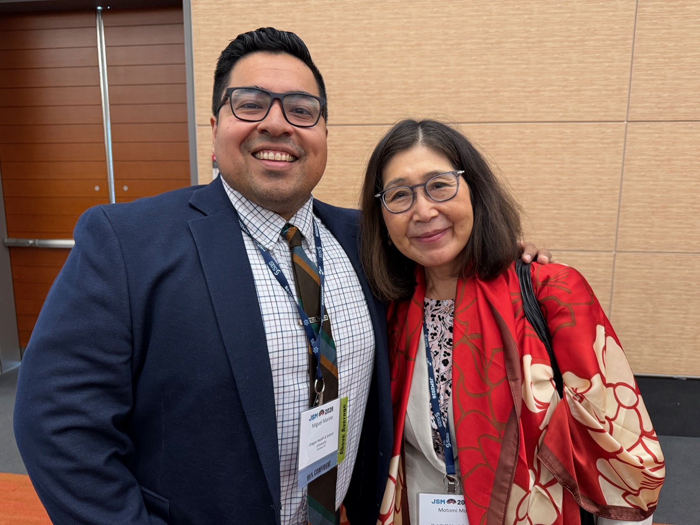
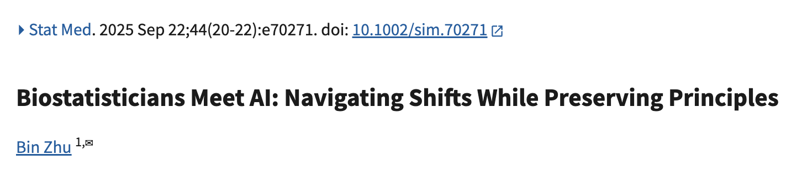
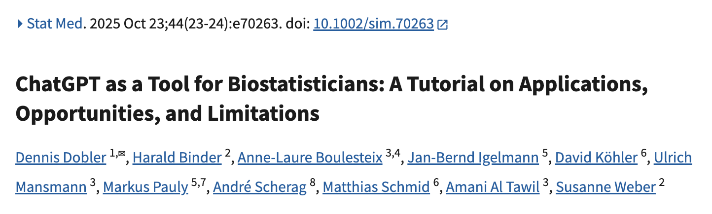
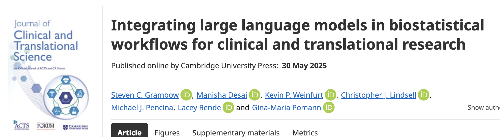
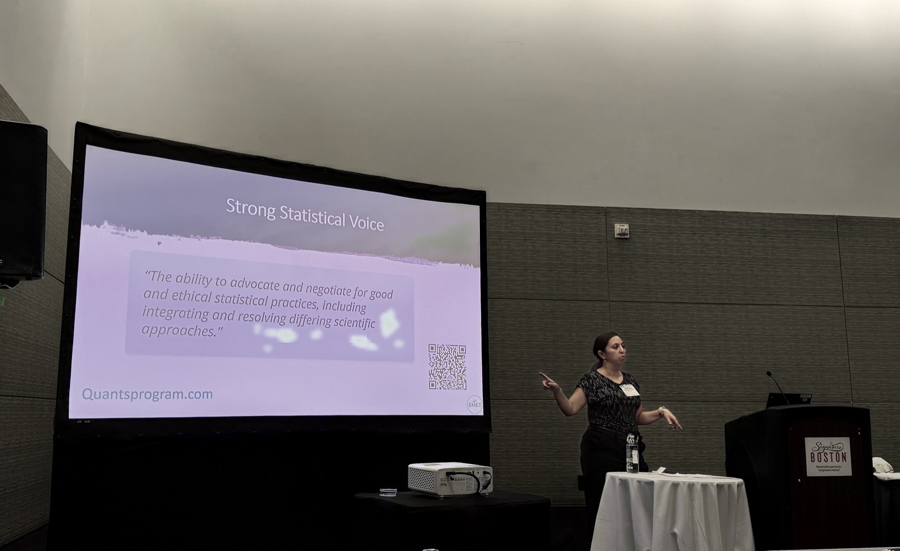
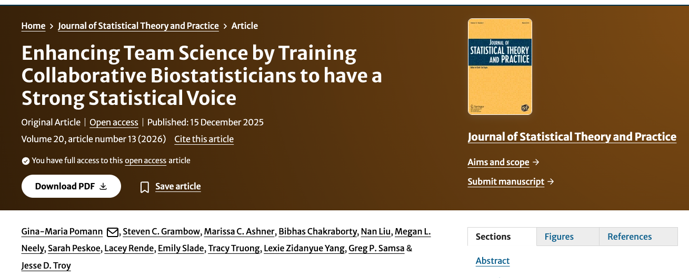
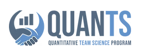

## JSM Award Session

{height=520 fig-align="center"}

::: {.notes}
Speaker notes go here.
:::

## Staying Relevant in the Age of AI {.small}

- Be a **useful human collaborator** (not just consultant) that brings problem solving skills, creativity, deep stats and data knowledge
- **Identify and show when AI is wrong** but accept it is here to stay
- Be **visible in the research community**, engage, ask questions, show up, teach workshops, establish trust ("Not on our to do list, but so important" -- Manisha Desai, Stanford)
- Embrace the tools, grow and learn, and **don't be left behind**

We have value! Make sure everyone knows it.

:::: {.columns}
::: {.column width="33%"}
::: {style="min-height:120px; display:flex; align-items:flex-end;"}
[{width=390}](https://doi.org/10.1002/sim.70271)
:::

::: {.vsmall}
Zhu (2025). *Biostatisticians Meet AI: Navigating Shifts While Preserving Principles.* Stat Med 44:e70271. [doi:10.1002/sim.70271](https://doi.org/10.1002/sim.70271)
:::
:::
::: {.column width="33%"}
::: {style="min-height:120px; display:flex; align-items:flex-end;"}
[{width=390}](https://doi.org/10.1002/sim.70263)
:::

::: {.vsmall}
Dobler et al. (2025). *ChatGPT as a Tool for Biostatisticians: A Tutorial on Applications, Opportunities, and Limitations.* Stat Med 44:e70263. [doi:10.1002/sim.70263](https://doi.org/10.1002/sim.70263)
:::
:::
::: {.column width="34%"}
::: {style="min-height:120px; display:flex; align-items:flex-end;"}
[{width=390}](https://doi.org/10.1017/cts.2025.10064)
:::

::: {.vsmall}
Grambow et al. (2025). *Integrating large language models in biostatistical workflows for clinical and translational research.* J Clin Transl Sci 9:e131. [doi:10.1017/cts.2025.10064](https://doi.org/10.1017/cts.2025.10064)
:::
:::
::::

::: {.notes}
Speaker notes go here.
:::

## Strong Statistical Voice {.small}

:::: {.columns}
::: {.column width="52%"}
{height=360 fig-align="center"}
:::
::: {.column width="48%"}
[{height=225 fig-align="center"}](https://doi.org/10.1007/s42519-025-00522-7)

::: {.vsmall}
Pomann et al. (2026). *Enhancing Team Science by Training Collaborative Biostatisticians to have a Strong Statistical Voice.* J Stat Theory Pract 20:13. [doi:10.1007/s42519-025-00522-7](https://doi.org/10.1007/s42519-025-00522-7)
:::
:::
::::

::: {style="text-align:center; margin-top:0.3em;"}
[{height=125}](https://quantsprogram.com)

[quantsprogram.com](https://quantsprogram.com)
:::

::: {.notes}
Speaker notes go here.
:::

## Engagement in the Knight

- Retreat discussion topic
- 2026–27 KCI/CDCB Faculty Research Exchange series
- Knight Research Day
- AI in Biology sessions
- Knight Retreat
- Knight Research Seminars (it's our job to learn the science, it's all relevant)

::: {.notes}
Speaker notes go here.
:::

## Thank you {.small}

*Slides made with the assistance of Claude Code*
